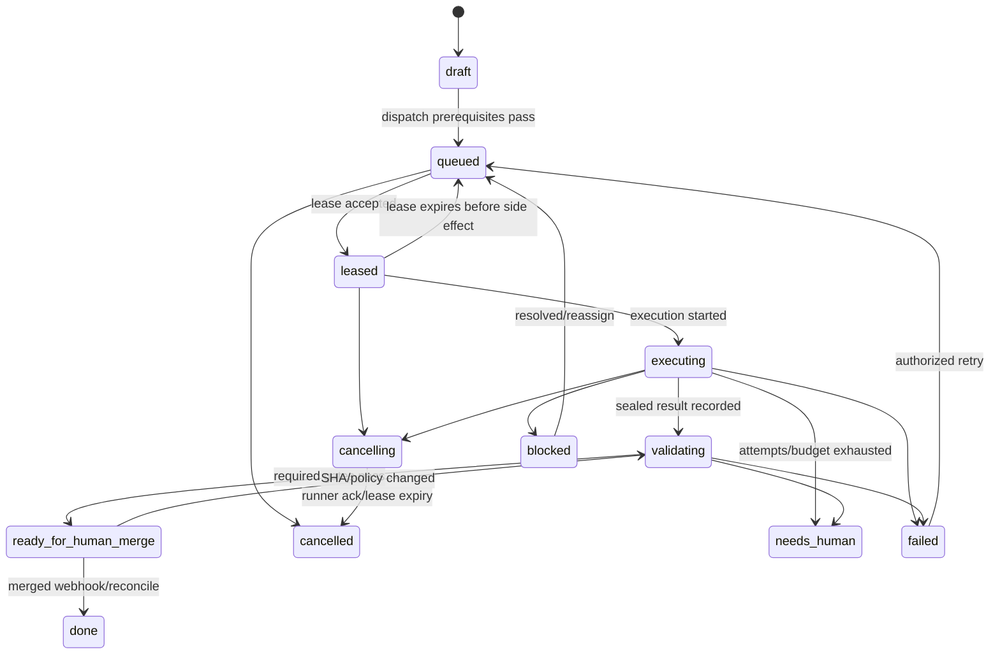
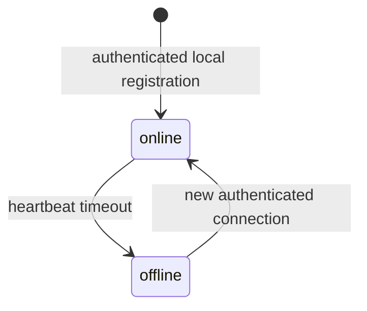
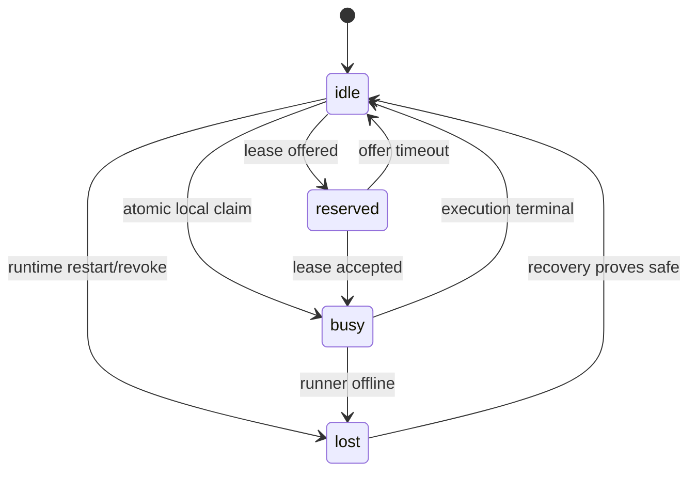
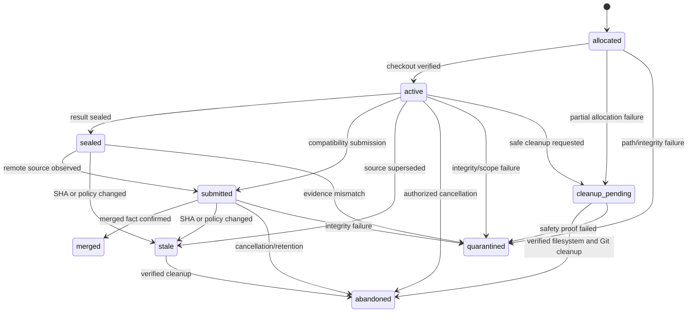
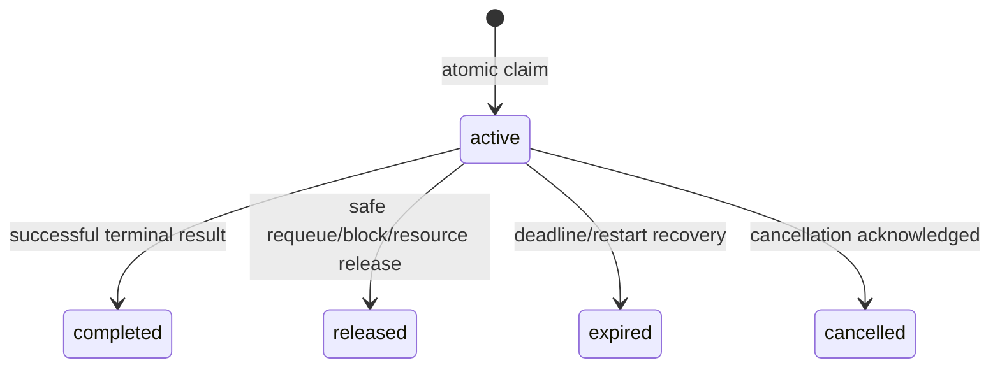

# 并发、Lease 与状态机模型

> 当前实现说明：M0 SQLite 基线已落地集中状态 registry、数据库状态约束、project-scoped Session、Task Lease/epoch/version、队列版本、幂等键、Heartbeat CAS，以及 Task/Session/Worker/Worktree 的逐资源状态历史。领取与恢复使用精确版本 CAS；活跃 Worktree 仅在干净且可证明安全时重绑定，存在修改或不确定性时先隔离/清理并阻止重新排队。单 maintenance owner 在事务内完成失效、补偿、资源回收和启动恢复，schema catalog/完整性 gate 与跨进程迁移锁共同阻止旧版本或伪造数据库运行。schema v5 与服务层均禁止本地伪造 `done`。本文同时描述 M1 PostgreSQL/Runner 目标；Outbox、`SKIP LOCKED`、设备连接 generation 和跨 Runner fencing 尚未实现，因此整体状态仍为 `partial`。

## 1. 目标与非目标

- `CON-REQ-001`：Task、Session、Worker、Workspace 的合法迁移 MUST 由 Domain 状态机集中定义并受数据库约束。
- `CON-REQ-002`：分配采用有期限、可吊销的 Lease；并发写采用固定锁顺序、乐观版本与幂等键。
- `CON-REQ-003`：超时、进程崩溃、重复/乱序结果 MUST 可确定性恢复且不把失败误判成功。
- 非目标：不保证外部 GitLab/Runner 与数据库分布式强事务；通过 Inbox/Outbox 和对账达成最终一致。

## 2. 参与者、角色、权限和信任边界

Coordinator 可创建/取消/重试 Task；Developer/Agent 只在有效 Lease 下执行；Verifier 不能验证自己/自己委托 Agent 的变更；Runner 设备只处理绑定项目 Lease；scheduler/dispatcher 是服务身份。状态迁移权限由 RBAC 与 domain guard 双重验证。

## 3. 触发条件、输入和前置条件

命令包含资源 ID、expected version、幂等键和 reason；可信 actor/项目从上下文获得。领取前项目/Runner active、依赖满足、无 active Lease、预算与容量足够；提交前 Lease nonce、owner、expiry、source SHA、workspace generation 必须匹配。

## 4. 正常交互及时序图

## 5. 失败、取消、超时、重试、恢复和用户提示

- M0 active Lease 默认 60s；`heartbeat_task` 以精确 Lease ID、epoch、version 和幂等键续约，服务端时钟为准。长验证在启动受控 Profile 前以 CAS 延长 Lease；M1 Runner SHOULD 在租期耗尽前周期续约。
- M0 Session 超时由 `stale_timeout`（默认 120s）和扫描周期判定为 `offline`；Session 离线不得立即重派仍持有 live Lease 的任务。M1 的连接 `suspect/draining` 属于 Runner connection 状态，不得混入 Session wire enum。
- 迟到结果保存 `late=true`，不推进状态；返回 `LEASE_EXPIRED` 和当前 version。
- cancel 是两阶段：WorkItem 进入 `cancelling` 后派发 cancel；ack 或 Lease expiry 才 `cancelled`。UI 显示当前阶段与截止时间。
- serialization/deadlock 最多重试 3 次；状态冲突不自动重放业务意图，返回 `CONCURRENT_CONFLICT`。

## 6. 状态机、规则和不可变式

合法迁移表由代码生成/单一 registry 定义，包含 from/to/action/actor/guards/audit event；未列迁移默认拒绝。WorkItem enum 以 `PRD-TASK-MANAGEMENT` 为语义真源、以 Control Plane OpenAPI 为 wire 真源，固定为 `draft/queued/leased/executing/validating/ready_for_human_merge/done/blocked/cancelling/cancelled/failed/needs_human`。

- `CON-INV-001`：同一 Task 最多一个 active Lease；同一 Worker 最多一个 busy Execution。
- `CON-INV-002`：每次状态变化 version+1，并写 actor、reason、occurred_at、causation ID。
- `CON-INV-003`：`done` 只能由 merged webhook/reconcile；Runner/Agent/Verifier 无此 transition 权限。
- `CON-INV-004`：状态不得倒退覆盖历史；重试生成新 attempt/Lease，保留旧执行。
- `CON-INV-005`：Workspace generation 与 Lease 绑定，旧 generation 结果永远不能用于新 Lease。

## 7. 字段、配置和格式校验

M0 Lease 必含 `id, project_id, task_id, session_id, worker_id, epoch, status, version, expires_at, created_at, updated_at`；ID 为随机 UUID，`epoch/version >= 1`，`expires_at` 必须晚于签发时间，客户端时间仅作诊断。M1 在该不变量上增加 `runner_id/connection_generation/nonce_hash/attempt/workspace_generation/profile_digest`；nonce 至少 128-bit 随机且只存 hash。扩展字段上线前不得伪造默认值参与授权。

## 8. 并发、幂等和一致性

锁顺序固定：`project → work_item → lease → execution → workspace → evidence → gate`；禁止逆序。M0 SQLite 使用短写事务、条件 UPDATE、queue version 和部分唯一索引守护 active Lease；事务内禁止重新经基础 DB Store 查询。M1 PostgreSQL scheduler 使用 `FOR UPDATE SKIP LOCKED`。API 乐观锁 expected version；事件消费者通过 event ID 唯一约束幂等。M1 Outbox 保证 commit 后投递，reconciler 以外部 source-of-truth 修复漏事件，但不得覆盖更高版本事实。

## 9. 安全、Secret、隐私和审计

Lease token 只经已认证 Runner 通道传输，日志存 hash；取消/续约必须校验 runner、project、nonce 与 generation。所有失败迁移和越权尝试审计。资源争用、nonce 重放、异常心跳频率触发 Runner 隔离；状态 history 不含源码/Secret。

## 10. 质量门禁、证据与 fail-closed 规则

- `CON-GATE-001`：状态机 model-based test 覆盖所有合法/非法边和角色。
- `CON-GATE-002`：`go test -race` 与 PostgreSQL 并发测试证明一次 Lease、一次业务效果。
- `CON-GATE-003`：kill -9、网络分区、乱序/重复/迟到消息下不得双执行推进或误 done。
- `CON-GATE-004`：任何缺失 version/Lease/generation 的提交 fail-closed。

## 11. 指标、SLO、告警和运维动作

监控 queue wait、lease offer/accept/expire、heartbeat lag、late result、conflict/retry、stuck state age、lock wait/deadlock。active Lease 超过最大时长+grace、同 Task 多 active 约束异常、`cancelling` 超 2 分钟或 ready_for_human_merge SHA stale 立即告警。

## 12. 验收测试和需求追踪

| 测试 ID | 场景 |
| --- | --- |
| `TC-CON-001` | 100 并发 scheduler 对一 Task 仅一个 Lease |
| `TC-CON-002` | 旧 nonce/generation/过期 Lease 结果被隔离 |
| `TC-CON-003` | 每个非法角色/非法状态迁移返回 409/403 并审计 |
| `TC-CON-004` | crash/restart 后 Task、Session、Worker、Workspace 满足不变量 |
| `TC-CON-005` | cancel/renew/result 乱序仍得到确定终态 |

状态 registry、AsyncAPI event 与测试矩阵必须由 CI 比对，防止新增状态未定义消费者。

## 13. 数据迁移、兼容、发布与回滚

为旧 Task/Session/Worker/Worktree 增加 version、history 与 generation；v2.1 的 `in_progress` 在 cutover 时不直接生成 active Lease，先进入迁移暂存态 `needs_reconcile`（该值不属于 v3 WorkItem wire enum），由人工/Runner handshake 后显式映射。灰度期旧领取入口设只读并记录 shadow decision。切换后旧 session 全部失效。回滚版本必须理解新状态；否则先排空 Lease并冻结不可识别状态，禁止映射成 `queued` 后盲目重跑。
