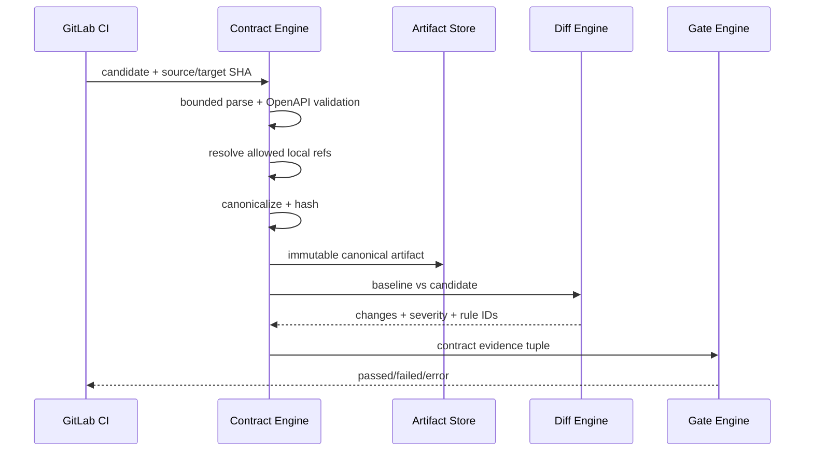
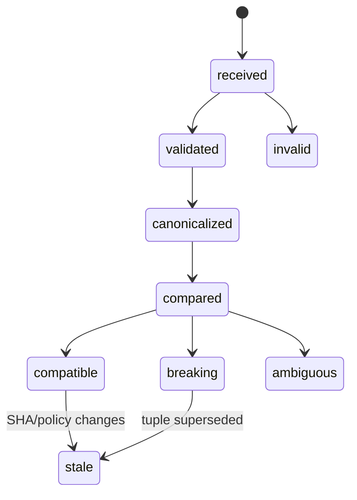

# OpenAPI 契约引擎

> 当前实现说明：现有 `ContractService` 只解析 OpenAPI JSON 的 method/path/description，遇到 malformed path 会跳过，不支持 YAML、完整 request/response/schema/ref、规范化版本 hash 或兼容性 diff；解析失败还可能被上层降级。v3 门禁尚未实现。

## 1. 目标与非目标

- `CTR-REQ-001`：引擎 MUST 完整摄取 OpenAPI 3.x JSON/YAML，验证 request/response/parameter/security/schema，并产出确定性 canonical document 与 SHA-256 version hash。
- `CTR-REQ-002`：对基线与候选版本 MUST 输出可解释的 breaking/non_breaking/ambiguous diff，并可作为跨仓 Required Gate。
- `CTR-REQ-003`：契约缺失、无效、外部引用不可达或规则无法判断时 MUST fail-closed（适用 Gate 时）。
- 非目标：M3 不承诺 GraphQL/Protobuf；不根据运行流量自动改写 OpenAPI；不把 LLM 判断作为兼容性事实源。

## 2. 参与者、角色、权限和信任边界

Project admin 配置契约源/责任仓库；Developer 提交候选；CI producer 上传 artifact/digest；Contract Engine 为确定性服务；Coordinator 查看影响并派发 Task；Verifier 审核允许豁免的 ambiguous 变化。仓库契约与 `$ref` 均为不可信输入，不能发起任意网络/文件读取。

## 3. 触发条件、输入和前置条件

触发于 MR pipeline、明确 re-evaluate、集成组合创建。输入必须有 project/repository、source/target SHA、source file、media type、policy version、最大大小和允许 ref root。基线必须来自目标分支远端 SHA 的成功 artifact；无基线时按项目 bootstrap policy 阻断或要求人工录入，不能默认兼容。

## 4. 正常交互及时序图

Canonicalization MUST：解析 YAML/JSON → 展开允许的 local refs 或记录稳定引用 → 去除非语义字段（仅 policy 指定）→ 对 map key/enum/required 排序 → 规范化 path/method/media/status code → RFC 8785 风格 JSON 序列化 → SHA-256。

## 5. 失败、取消、超时、重试、恢复和用户提示

错误分 `CONTRACT_NOT_FOUND`、`FORMAT_UNSUPPORTED`、`PARSE_FAILED`、`VALIDATION_FAILED`、`REF_FORBIDDEN/UNRESOLVED/CYCLE`、`LIMIT_EXCEEDED`、`BASELINE_MISSING`、`DIFF_AMBIGUOUS`。解析/规则错误不自动重试；artifact 临时不可用可指数退避。取消终止解析并不产生 passed Evidence。用户结果逐项给 JSON Pointer、rule ID、old/new 摘要、责任仓库与修复建议，禁止仅显示“契约失败”。

## 6. 状态机、规则和不可变式

Breaking 基线至少包括：删除/重命名 path/method；新增 required parameter/body field；缩窄 request enum/range；扩大 required response field、删除既有 response field/status/media type；改变类型/格式/nullable；收紧认证。新增 optional 字段/path/response 可判 non-breaking；`oneOf/anyOf/discriminator` 等无法确定的复杂变化标 ambiguous 并按策略阻断。

- `CTR-INV-001`：同字节语义输入 canonical hash 稳定，与 YAML key 顺序无关。
- `CTR-INV-002`：diff 永远绑定两个不可变 hash 与规则集版本。
- `CTR-INV-003`：解析失败不得覆盖最后成功版本或返回空契约。

## 7. 字段、配置和格式校验

OpenAPI version 必须在受支持范围；文件默认 <=10MiB、节点 <=200k、ref depth <=32。operationId 在项目内唯一；path parameter 声明一致；response 至少一个成功/默认；schema 不允许无限递归。外部 HTTP/file ref 默认禁用，只允许 artifact 内相对路径且 canonical path 位于 ref root。规则配置通过 schema，未知 rule/级别拒绝。

## 8. 并发、幂等和一致性

摄取幂等键为 `(project,repository,source_sha,path,parser_version)`；canonical hash 相同复用 artifact。单一 source tuple 只允许一个 active parse attempt，失败重试生成 attempt。基线/候选读取同一组合快照；目标 SHA 改变令 diff stale。事件至少一次消费，由 tuple 唯一约束防重复 Gate。

## 9. 安全、Secret、隐私和审计

解析器在无网络、只读、资源受限沙箱；禁 YAML 自定义 tag/alias bomb、XML 外部实体、任意 file/URL ref。错误不回显完整契约，artifact 加密且按项目授权。记录 source/digest/parser/rules/result/actor 审计，不记录 schema 内示例可能含的 Secret；先运行 Secret scan。

## 10. 质量门禁、证据与 fail-closed 规则

- `CTR-GATE-001`：适用仓库必须有有效 candidate、有效远端 baseline 与 diff Evidence。
- `CTR-GATE-002`：breaking 阻断；ambiguous 默认阻断，只有允许豁免的 rule 可走双人限时 waiver。
- `CTR-GATE-003`：parser/rules/hash/SHA 任一不匹配为 stale/error。
- 对契约引擎自身使用官方 fixture、变异测试、差分测试与 parser 安全 fuzz；规则覆盖不得低于 90%。

## 11. 指标、SLO、告警和运维动作

记录 parse/diff duration、文档大小、ref 数、breaking rule、ambiguous、cache hit、stale 与 error。普通 10MiB 内文档 P95 解析+diff <10s；error rate >2%、hash 非确定、parser memory limit 触发立即告警并冻结 Gate 结果为 error。

## 12. 验收测试和需求追踪

| 测试 ID | 场景 |
| --- | --- |
| `TC-CTR-001` | JSON/YAML、完整 request/response/ref 得到相同 canonical hash |
| `TC-CTR-002` | breaking/non-breaking/ambiguous 规则 golden set |
| `TC-CTR-003` | 缺失/错误/循环/越界 ref fail-closed |
| `TC-CTR-004` | alias bomb、深递归、超大 schema、路径逃逸受限 |
| `TC-CTR-005` | target/source/policy 改变令 Gate stale |

## 13. 数据迁移、兼容、发布与回滚

旧 `api_contracts` method/path 行导入为 `legacy_index`，不作为版本基线。首次 v3 parse 生成 bootstrap report，由项目管理员确认 baseline。先 shadow diff 若干 MR，再启用 warning，最后 Required。parser/rules 版本升级需重算基线并比较结果漂移；回滚保留 canonical artifact，只能使用仍理解当前 rule/version 的前一引擎，不得回退为空契约降级。
