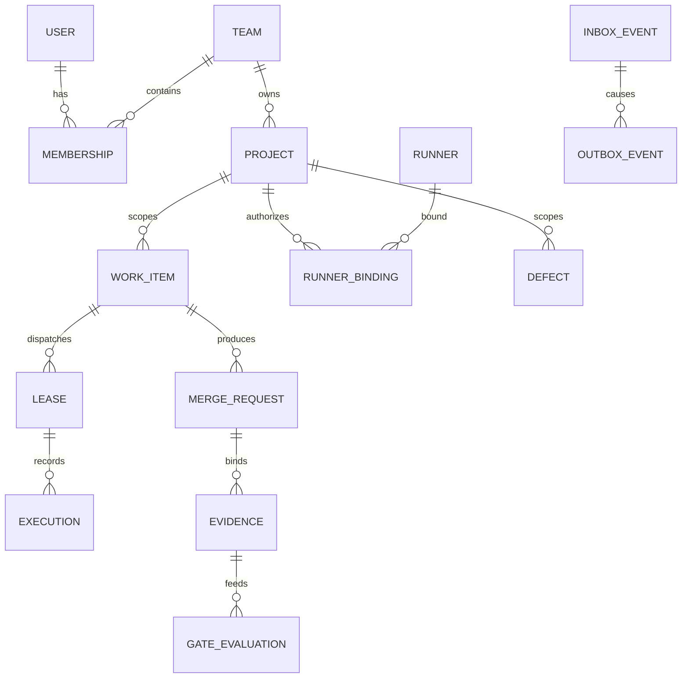

# PostgreSQL 数据模型

> 当前实现说明：M0 已升级到 SQLite schema v5，引入 project-scoped Session 查询/关系防护、Task Lease、版本/CAS、幂等记录、Task/Session/Worker/Worktree 状态历史和不可变的本地 Evidence authority。schema catalog 精确绑定每个迁移的版本、名称与 digest，并在启动时复核结构完整性；并发迁移以 `BEGIN IMMEDIATE` 和运行时文件锁在单一保留连接中锁定版本读取、DDL、marker 与外键检查。v5 的插入和更新约束及服务层在 M2 验签事实表落地前均禁止本地任务进入 `done`。v1 物理主键与 SQLite 单机模型仍不是强租户边界；User/Team/Membership/Runner、PostgreSQL 复合外键、GitLab、Gate、Defect 及 Inbox/Outbox 仍属 M1–M3。

## 1. 目标与非目标

- `DATA-REQ-001`：PostgreSQL MUST 是 Control Plane 唯一业务事实源，所有项目资源都受 team/project 范围约束。
- `DATA-REQ-002`：模型 MUST 支持身份、项目、Runner、任务执行、GitLab、Evidence/Gate、Defect、审计、Inbox/Outbox 和幂等。
- `DATA-REQ-003`：不可变事实（Evidence、AuditEvent、Webhook 原始摘要）只能追加或通过显式 supersede 关联，不得覆盖。
- 非目标：数据库不保存源码、完整测试日志大对象、明文凭据或可执行命令字符串。

## 2. 参与者、角色、权限和信任边界

Application Service 通过最小权限 DB role 访问业务表；migration role 单独持有 DDL；审计导出 role 只读 append-only 分区。Runner、Browser、Agent 与 GitLab 不得直连数据库。project-scoped 查询必须先具备服务端 `AuthorizationContext`，不得接受客户端拼接 SQL scope。

## 3. 触发条件、输入和前置条件

- 创建团队/项目要求已认证主体与相应 admin 权限。
- 创建 WorkItem/Lease 要求项目 active、membership 有效、Runner 已批准、策略版本 active。
- 写 GitLab 状态要求已验签 Inbox 事件或授权的 reconcile job。
- 写 Evidence 要求 producer、SHA、pipeline/job、policy version 和 payload digest 全部可验证。

## 4. 正常交互及时序图

事务写序：验证输入与授权 → 锁/版本检查 → 业务行 → AuditEvent → OutboxEvent → commit。外部副作用只能由 commit 后 dispatcher 执行。

## 5. 失败、取消、超时、重试、恢复和用户提示

违反唯一/外键/check 约束返回稳定业务错误；serialization failure 仅由 Application Service 最多重试 3 次并 jitter；连接丢失后用 Idempotency-Key 查询。软删除仅用于用户可恢复资源，Evidence/Audit/Inbox 禁止删除。长事务 > 2s 取消并记录指标；分区/存储不足时 readiness 失败，禁止丢弃审计后继续写业务。

## 6. 状态机、规则和不可变式

核心状态：

- Project：`draft → configuring → active → suspended → archived`。
- Runner：规范 enum 为 `pending_approval/approved/online/suspect/offline/draining/revoked`。
- WorkItem：规范 enum 为 `draft/queued/leased/executing/validating/ready_for_human_merge/done/blocked/cancelling/cancelled/failed/needs_human`，迁移边与语义以 `PRD-TASK-MANAGEMENT` 为准。
- Lease：规范 enum 为 `offered/accepted/active/completed/failed/cancelled/expired`。

`DATA-INV-001`：所有子表 MUST 同时携带 `project_id`，复合外键形如 `FOREIGN KEY(project_id, work_item_id) REFERENCES work_items(project_id,id)`；禁止仅靠全局 ID 推断 scope。  
`DATA-INV-002`：同一 WorkItem 最多一个 `WHERE status IN ('offered','accepted','active')` 的部分唯一 Lease。  
`DATA-INV-003`：`done` 必须有 `merged_at`、`merge_commit_sha` 与来源 Inbox/Reconcile ID。  
`DATA-INV-004`：Evidence 变 stale 只能追加状态事件，不修改原 payload/digest。

## 7. 字段、配置和格式校验

关键表与必需字段：

| 表 | 必需字段/约束 |
| --- | --- |
| `users` | `id`, normalized issuer+subject UNIQUE, status |
| `teams/memberships` | `(team_id,user_id)` UNIQUE, role enum, valid_from/to |
| `projects` | team_id, key, status, policy_id/version; `(team_id,key)` UNIQUE |
| `runners/runner_bindings` | device key hash, attestation/status; `(project_id,runner_id)` UNIQUE |
| `work_items` | project_id, type, status, version, creator, budget, timestamps |
| `leases/executions` | project_id+work_item_id, runner_id, nonce hash, expires_at, attempt |
| `gitlab_instances/project_mappings` | host, numeric project id, default branch, credential_ref |
| `merge_requests/pipelines/jobs` | source/target SHA, iid/external IDs, observed_at |
| `evidence/gate_evaluations/waivers` | immutable digest tuple, result, reason; requester != approver |
| `findings/defects` | fingerprint UNIQUE per project, occurrence, severity, lifecycle |
| `inbox_events/outbox_events` | event_id UNIQUE, payload digest, attempts, available_at |
| `audit_events` | actor/action/resource/decision/reason/correlation, append-only |

时间使用 `timestamptz` UTC，金额/覆盖率使用精确 numeric，JSONB 必须先过 schema 且不得替代应索引的关系字段。ID 为 UUIDv7；SHA、URL、enum 与 digest 使用 CHECK。

## 8. 并发、幂等和一致性

- 业务聚合行含 `version BIGINT NOT NULL`；更新为 `... WHERE id=? AND project_id=? AND version=? RETURNING version`。
- 任务领取先 `SELECT ... FOR UPDATE SKIP LOCKED`，再插入受部分唯一索引保护的 Lease。
- `api_idempotency` 唯一 `(principal_id, project_id, operation, key)`，保存 request hash；同 key 不同 body 返回 `IDEMPOTENCY_KEY_REUSED`。
- Inbox 唯一 `(gitlab_instance_id, external_event_id)`；没有 event ID 时用 raw body SHA-256 与时间窗口。

## 9. 安全、Secret、隐私和审计

数据库只保存 `credential_ref`、token/key 哈希与最后四位标识。PII 分级，用户 subject 与 IP 加密/受控访问；Prompt/Tool 轨迹仅存加密对象引用并 30 天到期。启用 TLS、静态加密、PITR、审计 role。Row Level Security MAY 作纵深防御，但不能替代 Application 授权与复合 scope 约束。

## 10. 质量门禁、证据与 fail-closed 规则

- `DATA-GATE-001`：schema lint 必须证明所有项目子资源具备 project scope 与复合 FK。
- `DATA-GATE-002`：Evidence/Audit/Inbox 更新或删除权限测试必须失败。
- `DATA-GATE-003`：无 Audit/Outbox 的状态事务不可提交（通过 service/trigger 测试验证）。
- migration 必须具备 up、兼容窗口、数据校验 SQL、容量估算与恢复方案；未经 dry-run 不得生产执行。

## 11. 指标、SLO、告警和运维动作

监控连接池、锁等待、deadlock、serialization retry、慢查询、表/分区增长、replication/WAL lag、backup age 与 migration duration。连接池耗尽 2 分钟、复制延迟 > 60s、最近成功备份 > 24h、审计插入失败立即告警并关闭相关写入口。

## 12. 验收测试和需求追踪

| 测试 ID | 场景 |
| --- | --- |
| `TC-DATA-001` | 伪造跨项目子 ID 因复合 FK/查询 scope 失败 |
| `TC-DATA-002` | 100 并发领取仅生成一个 active Lease |
| `TC-DATA-003` | 同幂等键同 body 返回同结果，不同 body 被拒 |
| `TC-DATA-004` | 状态、审计、Outbox 原子提交/原子回滚 |
| `TC-DATA-005` | Evidence 不可改写且 SHA 漂移追加 stale 事实 |

实施与验证状态必须由迁移测试和 PostgreSQL 集成测试更新，不沿用 SQLite 单测结论。

## 13. 数据迁移、兼容、发布与回滚

SQLite 导入流程：冻结写入并备份 → 校验 schema/foreign key → dry-run 转换与 ID 映射 → PostgreSQL staging 导入 → 行数/摘要/关系/状态不变量对账 → shadow read → 切换。无法映射的跨项目 Session、无 worktree、非法状态进入 quarantine，不得静默修复。迁移采用 expand/contract；旧列至少跨一个 minor 保留。回滚发生在 cutover 前可恢复 SQLite 只读副本；cutover 后只允许 PostgreSQL PITR/forward-fix，禁止双向同步。
