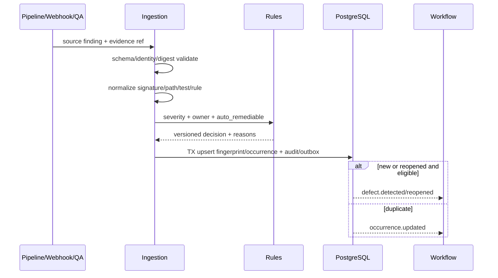
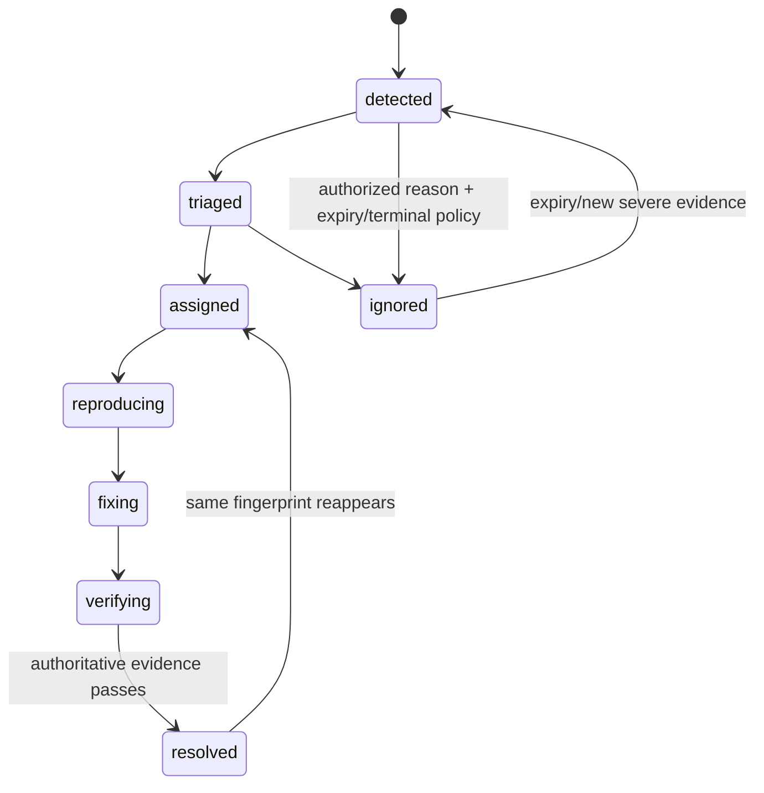

# Finding 摄取、Defect 去重与派发

> 当前实现说明：仓库当前没有 Finding/Defect/TestFailure 数据模型、摄取 pipeline、指纹、去重、重开或责任路由；本规范为 M3 新建能力。

## 1. 目标与非目标

- `DEFING-REQ-001`：Pipeline、JUnit、契约、SAST、Secret、依赖/镜像扫描和人工 QA Finding MUST 归一为可追踪 Defect。
- `DEFING-REQ-002`：重复 Finding MUST 增加 occurrence 并关联新 Evidence，不重复建单；resolved 后相同指纹重现 MUST reopen。
- `DEFING-REQ-003`：严重度、可自动修复性、责任仓库/团队和状态迁移 MUST 由版本化确定性规则生成，可人工受权修订并审计。
- 非目标：不使用 LLM 作为唯一去重/严重度事实源，不自动关闭无权威复测 Evidence 的 Defect。

## 2. 参与者、角色、权限和信任边界

CI/Webhook producer 提供不可信外部 payload；Ingestion Worker 验证/规范化；Rule Engine 计算 fingerprint/severity/owner；Coordinator triage/assign/ignore；Developer/Agent 修复；Verifier/CI 确认 resolved。Secret Finding 内容受限，仅 security_owner/授权项目角色查看脱敏详情；Agent 默认不得接收 Secret 值。

## 3. 触发条件、输入和前置条件

事件必须来自已验签 Inbox 或授权人工 API，包含 project、source type、source SHA/branch、producer/external ID、occurred_at、原始 artifact digest。解析器、规则集和 severity mapping 版本必须 active。项目/仓库 mapping 不明、artifact digest 不匹配或 source SHA 缺失时隔离为 ingestion error，不能建立“正常” Defect。

## 4. 正常交互及时序图

规范化顺序：source adapter → 字段清洗/脱敏 → stack/error signature 标准化 → path/module/test/rule identity → fingerprint → severity/owner/eligibility → transactional upsert。

## 5. 失败、取消、超时、重试、恢复和用户提示

解析失败记录 `INGEST_SCHEMA_INVALID` 并进入 quarantine；artifact 暂不可用可幂等退避；未知 source/rule 不静默丢弃，形成可见 ingestion_error。批量摄取逐项结果，单项恶意 payload 不阻塞全批。人工取消自动派发只影响 Workflow，不删除 Defect。UI 显示来源、首次/最近发生、occurrence、当前/历史 SHA、去重理由、责任规则和失败重试状态。

## 6. 状态机、规则和不可变式

Defect wire enum 固定为 `detected/triaged/assigned/reproducing/fixing/verifying/resolved/ignored`。无法复现、预算耗尽或上下文不足只把关联 WorkItem/RemediationRun 转 `needs_human`；Defect 保持可见的 `assigned/reproducing` 并记录 disposition/owner，不新增 Defect 状态。

- `DEF-INV-001`：fingerprint 原始组成与算法版本保存，hash 为 `project + repository + target branch + test/rule identity + normalized error signature`；路径仅使用规范化相对路径。
- `DEF-INV-002`：重复事件只增 occurrence/last_seen 并新增 occurrence row/Evidence link，不覆盖首次事实。
- `DEF-INV-003`：resolved 必须有与修复 source SHA 关联的权威 pass Evidence；MR 创建/本地测试不等于 resolved。
- `DEF-INV-004`：Critical/High 安全 Finding 不得自动 ignored/auto-remediate（除非专项安全策略明确且不可绕过审批）。

## 7. 字段、配置和格式校验

Finding 必含 source/source_event_id/check identity/status/severity raw/message signature/project/repository/branch/source SHA/evidence ref；Defect 必含 fingerprint+version、severity normalized、state、occurrence_count、first/last seen、owner rule/version、auto_remediable、reproduction、关联 Task/MR/Pipeline。message/signature 有长度/字符限制；stack trace 规范化移除地址、时间戳、随机 ID 但保留函数/错误类型。人工 severity/owner override 必含 reason、expiry 与 actor。

## 8. 并发、幂等和一致性

source event 唯一 `(producer, external_id, item_index)`；Defect 唯一 `(project_id,fingerprint,algorithm_version,active_generation)`。upsert 使用行锁/原子 `occurrence_count+1`；resolved 与新 occurrence 并发时 occurrence 获胜并 reopen。Outbox 与 upsert 同事务。相似度/LLM 建议 MAY 提供候选，但合并 Defect 必须人工确认且可逆。

## 9. 安全、Secret、隐私和审计

Parser 在资源受限环境，防 XML entity/zip bomb/路径逃逸；所有文本视作 Prompt injection，不可转为指令。先 Secret 检测/脱敏再持久化和 Agent context；原 artifact 加密按项目授权。审计 ingestion decision、fingerprint/rule version、severity/owner override、ignore/reopen、自动派发与访问 Secret Finding。

## 10. 质量门禁、证据与 fail-closed 规则

- `DEF-GATE-001`：来源身份、project/SHA、artifact digest 或 parser 失败时不得创建可自动修复 Defect。
- `DEF-GATE-002`：关闭 Defect 必须绑定权威 Evidence 与修复 SHA；缺失/错误/stale 仍为 verifying/open。
- `DEF-GATE-003`：去重 golden set 的 precision/recall 达预定阈值，安全问题 false merge 为零。
- `DEF-GATE-004`：Critical/High、Secret、不可复现问题强制 human route。

## 11. 指标、SLO、告警和运维动作

监控 ingestion lag/rate/error/quarantine、new/duplicate/reopen、fingerprint collision、severity、unassigned age、MTTA/MTTR、auto-remediation yield。Critical Finding 摄取延迟 >2 分钟、quarantine 突增、collision 或安全 Finding 被 auto route 立即告警并暂停自动派发。

## 12. 验收测试和需求追踪

| 测试 ID | 场景 |
| --- | --- |
| `TC-DEFING-001` | JUnit/Pipeline/Contract/SAST/Secret/人工 QA adapter |
| `TC-DEFING-002` | 同错误动态时间戳/行号去重，不同错误不误合并 |
| `TC-DEFING-003` | 并发重复只一个 Defect、occurrence 精确增长 |
| `TC-DEFING-004` | resolved 后重现 reopen，stale pass 不能关闭 |
| `TC-DEFING-005` | 注入、Secret、恶意 artifact 不扩大权限/不泄露 |

## 13. 数据迁移、兼容、发布与回滚

历史 `validation_runs` 仅可离线导入为 `legacy_finding`，无可靠 source SHA/producer 的记录不自动建 active Defect。先 shadow 摄取并与人工 triage 比较，再启用通知，最后对 allowlist 开自动派发。fingerprint 算法升级保留旧版并建立 alias/reindex 报告，禁止原地改变 hash。回滚停止消费者但保留 Inbox，恢复后按 event ID 重放。
