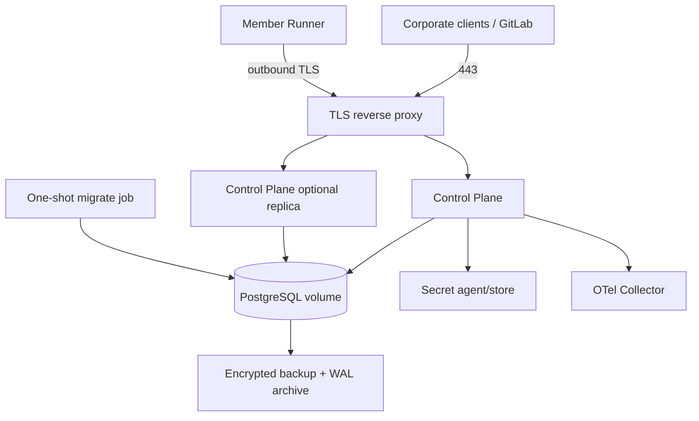

# 公司 VM + Docker Compose 部署设计

> 当前实现说明：M0 Compose 已能从源码构建 Web 与真实 Go 入口，以非 root、只读 rootfs、`cap-drop ALL` 单服务镜像运行，仅挂载 SQLite 数据卷；`livez/readyz` 可匿名探测，非健康端点在未配置 Token 时 fail-closed。该单机开发基线仍缺少 M1 的 TLS edge、PostgreSQL、migration job、Secret Store、备份/PITR 与独立 Runner，不得当作 v3 生产拓扑。

## 1. 目标与非目标

- `DEPTECH-REQ-001`：M1 MUST 在公司 VM 以 Docker Compose 部署 Control Plane、PostgreSQL、TLS edge、migration job 与观测组件；成员侧 Runner 独立安装并仅出站连接。
- `DEPTECH-REQ-002`：部署 MUST 无源码/workspace/Docker Socket 挂载、无明文 Secret、非 root、最小网络与持久卷权限。
- `DEPTECH-REQ-003`：升级、回滚、备份/PITR、readiness、优雅排空和配置 schema MUST 可操作与演练。
- 非目标：M1 不承诺 Kubernetes/跨区域 HA；不在中央 VM 执行项目构建/测试。

## 2. 参与者、角色、权限和信任边界

Operator 管 VM/Compose；migration identity 只用于 DDL；server DB role 仅 DML；TLS edge 暴露 443；PostgreSQL/OTel/backup 仅内网；Runner 在成员设备以设备身份连接。Secret Store/agent 提供短期凭据引用；Compose 文件与环境不含 token/private key 明文。

## 3. 触发条件、输入和前置条件

VM 已加固、DNS/TLS/防火墙/时间同步/磁盘和备份目标就绪；镜像使用经签名 digest；配置通过 schema；OIDC/GitLab Host allowlist 确认；PostgreSQL backup/PITR 初始化。发布前执行 `maestro doctor`、migration dry-run、容量与兼容检查。

## 4. 正常交互及时序图

Compose 服务最小集合：`edge`、`control-plane`、`postgres`、`migrate`（profile/one-shot）、`otel-collector`、`backup`。可选双 Control Plane 仍为单 VM 容错，不等于 HA。启动顺序为 postgres ready → migrate success → control-plane ready → edge 切流。

## 5. 失败、取消、超时、重试、恢复和用户提示

migration 失败阻止新版本 server ready；edge 保持 maintenance/上一兼容版本。server SIGTERM 先 readiness false 并 30s 排空；backup 失败不删除旧备份并告警。Secret Store/OIDC/GitLab 异常只减少能力，不能降级匿名/跳 Gate。部署取消停止尚未启动服务，不中断正在执行的不可逆 migration。operator 输出明确失败组件、digest、config/migration version 与 runbook 链接。

## 6. 状态机、规则和不可变式

部署：`preflight → migrating → starting → ready → draining → stopped`；失败为 `blocked`，修复后从 preflight 重入。

- `DEP-INV-001`：edge 只向 ready 实例转发，`livez` 不参与流量准入。
- `DEP-INV-002`：Control Plane 容器无项目源码、workspace、Docker Socket、宿主 HOME/SSH/设备挂载。
- `DEP-INV-003`：镜像 digest、配置 digest、schema version 与部署 ID 全审计且可复现。
- `DEP-INV-004`：数据库/备份卷不得由 Control Plane 容器 root 写入；服务使用独立 UID/network。

## 7. 字段、配置和格式校验

配置包含 public base URL、listen、DB `secret_ref`、OIDC issuer/client、GitLab allowlist、MCP resource metadata、retention/SLO、feature flags；未知字段、空 Secret ref、HTTP 外部 URL、宽泛 Origin、`latest` image 失败。Compose 必须设置 read_only、tmpfs、cap_drop ALL、no-new-privileges、pids/memory/cpu、healthcheck、restart policy、日志轮转与显式 network；Postgres 使用独立持久卷。

## 8. 并发、幂等和一致性

Migrate 通过 advisory lock 单实例；Control Plane 多副本共享 PostgreSQL idempotency/Outbox，dispatcher leader lease 防重复但消费者仍幂等。滚动发布先新后旧排空，协议兼容当前/前一 minor。Compose 操作使用唯一 deployment ID；重复执行同 digest/config 幂等。

## 9. 安全、Secret、隐私和审计

VM 最小入站 443/管理网，DB 不暴露宿主端口；TLS 1.2+、证书自动轮换与 HSTS。镜像签名/SBOM/漏洞门禁；容器 rootless/非 privileged、只读 rootfs。Secret 通过企业 store/文件描述符注入，轮换不重建镜像。审计部署、配置/Secret ref、证书、migration、backup/restore、紧急停机和 credential revoke。

## 10. 质量门禁、证据与 fail-closed 规则

- `DEP-GATE-001`：clean VM/clone 可按 runbook 启动真实服务并通过 REST/MCP/Web smoke。
- `DEP-GATE-002`：Compose policy scan 证明无 latest/root/privileged/socket/workspace/明文 Secret/公网 DB。
- `DEP-GATE-003`：签名、SBOM、Critical/High scan、配置 schema、migration dry-run、backup restore Required。
- `DEP-GATE-004`：OIDC/DB/Secret/GitLab 依赖故障不得开放匿名或错误 readiness。

## 11. 指标、SLO、告警和运维动作

月可用性 99.5%；普通 API P95 <500ms，Webhook 持久化 P95 <2s。监控 VM/容器 CPU/内存/磁盘/inode/restart、ready、cert expiry、DB/WAL/backup、migration、edge 5xx。磁盘 >80%、证书 <30d、backup >24h、restart loop、ready false >2m、WAL archive fail 告警。

## 12. 验收测试和需求追踪

| 测试 ID | 场景 |
| --- | --- |
| `TC-DEPTECH-001` | clean VM Compose 安装/启动/升级/回滚 |
| `TC-DEPTECH-002` | 容器权限/挂载/网络/Secret policy 检查 |
| `TC-DEPTECH-003` | OIDC/DB/GitLab/Secret 故障 readiness 与安全降级 |
| `TC-DEPTECH-004` | 每日备份、PITR/restore 对账，RPO15m/RTO4h |
| `TC-DEPTECH-005` | SIGTERM 排空、双副本/dispatcher 幂等 |

试点需要 2–5 个 Go/TypeScript 仓库影子运行与人工验收；文档/Compose 存在不等于 verification passed。

## 13. 数据迁移、兼容、发布与回滚

先建立可执行/镜像基线，再并行部署 PostgreSQL，执行 SQLite 只读导入与 shadow compare，最后切换 v3。升级遵循 expand/backfill/cutover/contract，配置 feature flag 逐项开启 Runner/GitLab/Gate/Agent。回滚到上一签名 digest并保持新 schema兼容；若 contract migration 已执行则 forward-fix。每次发布前/后备份并记录 restore point；不允许通过恢复旧 SQLite 实例形成双主。
