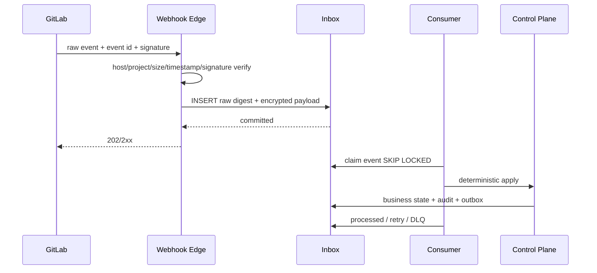

# GitLab Connector、Webhook 与对账

> 当前实现说明：仓库目前没有 GitLab client、Instance/Project mapping、Webhook、MR/Pipeline/Job 数据模型或 `.gitlab-ci.yml`；本地 `HEAD`/merge 逻辑不得被视为 GitLab 集成。

## 1. 目标与非目标

- `GLINT-REQ-001`：Connector MUST 以配置的自建 GitLab 作为远端分支、MR、Pipeline、Job 与 merged 状态事实源。
- `GLINT-REQ-002`：Webhook MUST 对原始报文验真、先持久化 Inbox 再 2xx，并支持幂等、乱序、退避、DLQ、重放与周期对账。
- `GLINT-REQ-003`：只有成员侧 Runner 的宿主 Git broker可 push `maestro/*` 任务分支；中央 Bot 只查询状态并创建/更新 MR，不具备源码 push 或 merge capability。任何组件都不得更新保护分支或自行标 done。
- 非目标：不代理用户访问 token，不替代 GitLab approval/protected branch，不把缓存状态当新授权依据。

## 2. 参与者、角色、权限和信任边界

platform_admin 配置 GitLab Instance/Host 与能力；project_admin 映射 numeric project、default branch、webhook；GitLab Bot 使用不含 source push/merge capability 的最小 project/group token；Runner 宿主 Git broker 使用 OS Keychain 中的成员 credential 只推任务分支；Webhook sender 为外部不可信网络；Connector worker 为服务身份；人类在 GitLab 最终 merge。Agent 看不到任何 credential，不能选择任意 host/project/refspec。

## 3. 触发条件、输入和前置条件

Instance 必须 active、HTTPS、证书有效、Host allowlist、credential_ref 可解析；mapping 固定 `(instance_id, numeric_project_id)`、namespace、clone URL、default/target branch。Webhook 处理前需大小/时间戳/签名校验；API 动作前需 project scope、capability check、rate budget、expected SHA/idempotency。

## 4. 正常交互及时序图

任务流：读取远端 target SHA → Runner 创建 `maestro/<project>/<task>` → 宿主 Git broker 以 expected old SHA push exact source SHA → Connector Bot 创建/更新 MR → 观察 pipeline/job → 写 Evidence/Gate → 人在 GitLab merge → merged webhook/对账令 WorkItem done。

## 5. 失败、取消、超时、重试、恢复和用户提示

- 签名/时间戳/Host/project 无效：401/403，不落业务 Inbox，记录安全摘要；不得 2xx 后处理。
- Inbox 持久化失败：503 让 GitLab 重试；已提交后立即 2xx，业务处理不得阻塞响应。
- API 429/5xx/网络错误：仅幂等查询和带幂等保护的动作指数退避+jitter，尊重 Retry-After；超限 DLQ。
- 401/403/token revoked：停止新写、Instance degraded，告警轮换；不得尝试用户 token。
- GitLab 不可用：展示缓存 observed_at，只读；禁止新授权、ready/done。
- 人关闭/修改 MR、force push、branch 删除：对账更新明确 terminal/stale，绝不重建或覆盖人的选择，除非授权新命令。

## 6. 状态机、规则和不可变式

Inbox：`received → processing → processed`，失败为 `retry_wait → processing`，超限 `dead_letter → replayed`。MR mirror：`unknown/open/closed/merged`；Pipeline：`created/pending/running/success/failed/canceled/skipped/manual`，未知状态 error 并对账。

- `GL-INV-001`：baseline 必须是远端目标分支 SHA，禁止本地 HEAD。
- `GL-INV-002`：source/target SHA 变化立即令旧 Evidence/Gate stale。
- `GL-INV-003`：`done` 只由 merged webhook 或 API reconcile 确认，记录来源事件与 merge SHA。
- `GL-INV-004`：Webhook 重放/重复/乱序只产生一次且不倒退已确认外部终态。
- `GL-INV-005`：中央平台代码中不存在源码 push 与 merge API capability；Runner Git broker 固定 remote/project/task branch/expected SHA，拒绝自由 refspec 和保护分支。

## 7. 字段、配置和格式校验

Instance：`id, base_url, expected_host, tls_policy, credential_ref, api_version/capabilities, status`；mapping：`project_id, instance_id, gitlab_project_id, namespace, clone_url, default_branch, webhook_id`。禁止 IP literal、userinfo、非 HTTPS、DNS/redirect 越 allowlist。Webhook 保存 external event ID、type、received_at、timestamp、raw digest、signature key version、project numeric ID、delivery attempt；payload schema/字段不识别进 quarantine。

分支必须匹配 `maestro/<project-key>/<task-id>`；SHA 为 GitLab 返回的完整十六进制；MR 创建必须固定 source/target project/branch，不接受 Agent 输入 Host。

## 8. 并发、幂等和一致性

Webhook 唯一 `(instance_id, external_event_id)`；无 ID 时用 raw digest+受限窗口。消费者 `FOR UPDATE SKIP LOCKED`；按 `(instance, project, object type, object id)` causation/version 序列化。创建 MR 先按 source branch+目标查找，幂等键关联 WorkItem。Reconcile 定时查询 MR/pipeline/job/protected branch，每次写 observed_at/version；外部 API 是最终事实源，内部意图不覆盖它。

## 9. 安全、Secret、隐私和审计

Webhook 验证按平台能力分级：支持 HMAC 的平台对原始 bytes 验签 + timestamp/replay window；GitLab CE（自建基线）仅有静态共享 `X-Gitlab-Token`（S4 实测），采用常量时间比较 + TLS + received_at 短窗 + `(instance_id, X-Gitlab-Event-UUID)` 去重，payload 一律不可信。两种模式都要求 key rotation 与 hook 身份校验（`X-Gitlab-Webhook-UUID`）。Token 只在 Secret Store，日志仅 hash/last4；URL 防 SSRF/DNS rebinding/跨 Host redirect，TLS 不可关闭。审计 Instance/mapping/token rotation、Webhook deny/replay、API action、MR/pipeline sync、DLQ replay；payload 加密并按保留期删除。

## 10. 质量门禁、证据与 fail-closed 规则

- `GL-GATE-001`：无效签名不得产生 Inbox 业务效果；重复/乱序只一次状态变化。
- `GL-GATE-002`：SHA 漂移立即阻断 ready_for_human_merge。
- `GL-GATE-003`：Bot 无 source push/merge capability、broker 非任务 ref 拒绝及 GitLab 保护分支拒绝的实测证据均为 Required。
- `GL-GATE-004`：GitLab 不可用或 capability 未知时 Gate 为 error，不用缓存 pass。

## 11. 指标、SLO、告警和运维动作

指标：Webhook verify/persist latency、Inbox lag/depth、retry/DLQ、API latency/status/rate remaining、reconcile drift、stale Gate、token expiry。持久化 P95 <2s；Inbox P95 lag <30s。invalid signature 激增、DLQ>0、Webhook 自动禁用、token 7 天内到期、reconcile 漂移 >5 分钟告警。

## 12. 验收测试和需求追踪

| 测试 ID | 场景 |
| --- | --- |
| `TC-GLINT-001` | 签名正确/错误/过期/重放及原始 body 修改 |
| `TC-GLINT-002` | 重复、乱序、并发 event 与 DLQ 受权重放 |
| `TC-GLINT-003` | 远端 target/source SHA 漂移和 stale 传播 |
| `TC-GLINT-004` | Bot 无源码 push/merge；broker 只允许 task branch；保护分支纵深拒绝 |
| `TC-GLINT-005` | GitLab 中断、429、token 吊销、Webhook 漏失后 reconcile |

必须在隔离的自建 GitLab sandbox 运行，mock 不能作为出口 Gate 唯一证据。

## 13. 数据迁移、兼容、发布与回滚

新增 Instance/mapping/Inbox/外部 mirror 表，项目管理员显式 onboarding；旧本地 branch/merge 数据不自动映射为 MR/merged。先只读 reconcile，后启用 webhook，再启用 task branch/MR write，最终关闭本地 merge。按 GitLab 版本/套餐做 capability detection；不支持能力不得模拟成功。回滚只停 Connector 写入并保留 Inbox，恢复后重放/对账；不得回退到本地 HEAD/merge。
