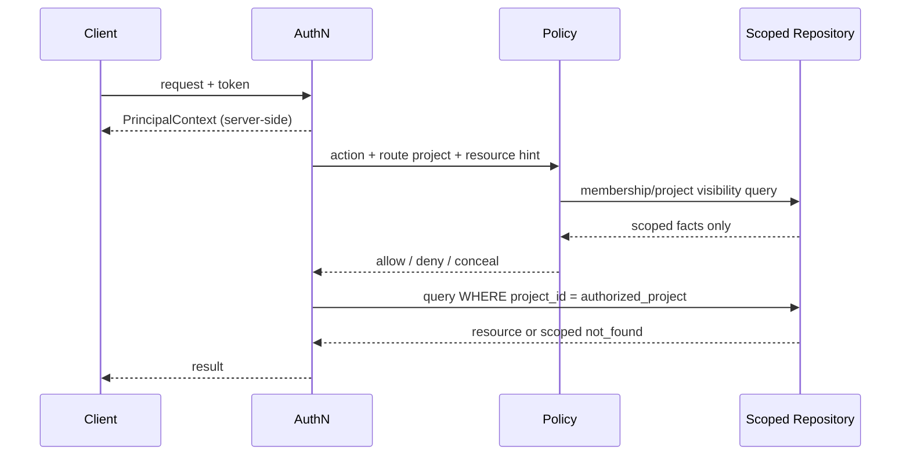

# 项目隔离与资源作用域

> 当前实现说明：M0 共享 Bearer 为空时已对所有非健康端点 fail-closed，远程写默认关闭，核心 Session/Task/Lease/Worktree 在 route、Service 和 SQLite trigger 层校验 project scope。但这仍是单机共享凭据基线：MCP 兼容目录仍注册多角色 Tool，调用方传入的 project/role/session 只与本地持久状态二次校验，且无 OIDC Membership/RBAC 和不可见资源 404 语义；完整强租户隔离尚未实现。

## 1. 目标与非目标

- `ISO-REQ-001`：所有读取、写入、事件、缓存、队列和 Runner 工作区 MUST 以服务端确定的 team/project scope 隔离，默认拒绝。
- `ISO-REQ-002`：不可见资源 MUST 返回 404，避免通过 ID、状态码、耗时、计数或事件推断其存在。
- `ISO-REQ-003`：Agent 权限 MUST 是委托用户、项目角色、Tool、Runner binding 与任务 Lease 的交集。
- 非目标：platform_admin 不因平台职务自动获得源码/项目内容读取权限；v3 不支持一个 Lease 同时跨多个项目。

## 2. 参与者、角色、权限和信任边界

| 主体 | Scope 来源 | 关键限制 |
| --- | --- | --- |
| 人类用户 | OIDC subject + Membership | membership 失效立即禁止新请求 |
| Agent | delegation + user membership + Tool + Lease | 不可提升角色或跨项目检索 |
| Runner | device identity + runner_binding | 每个 workspace/Lease 只绑定一个 project |
| GitLab Bot | instance/project mapping | 不使用调用者 token，不跨 mapping |
| background job | service identity + stored project | payload 内 project 仅用于一致性校验 |

鉴权语义固定：无有效认证 `401`；身份有效但明确缺少已知项目动作权限 `403`；调用者无项目可见性或资源不在可见项目 `404`。禁止先全局查 ID 再判断 scope。

## 3. 触发条件、输入和前置条件

所有入口必须先解析 `PrincipalContext`，再从路由/MCP 连接绑定或事件记录解析 project；payload 中的 `project_id/role/session_id` 不得作为授权依据。项目 active、membership/binding 未撤销、资源复合主键匹配是前置条件。跨项目协调必须拆为多个独立授权 command，不得使用“全局上下文”绕过。

## 4. 正常交互及时序图

MCP Streamable HTTP session可绑定零个或一个当前项目；切换项目 MUST 重新授权并创建新 session。stdio 从显式配置或已验证 cwd mapping 推导项目，多个匹配时拒绝而非任选。

## 5. 失败、取消、超时、重试、恢复和用户提示

- token 过期/issuer/audience 错误：401，不降级匿名；Browser 引导重新登录。
- membership/Runner binding 在操作中撤销：取消未开始 Lease，运行中 WorkItem 进入 `cancelling`；结果保存为隔离诊断，不推进 Gate。
- policy/DB 不可用：返回 `AUTHORIZATION_UNAVAILABLE`，写入 fail-closed；不得用缓存 allow，短期缓存只可复用 deny。
- 项目归档：读权限按策略提供，所有新写和 Lease 返回 403；恢复须 project_admin 审计操作。
- 批量请求每项独立 scope，禁止因一项可见泄露其他项；响应只给调用者可见计数。

## 6. 状态机、规则和不可变式

授权资源状态：`unknown → visible → authorized`；任何 membership/binding/token 变化均使缓存 `invalidated`。

- `ISO-INV-001`：Principal、role、project、delegation 与 trusted session MUST 只来自服务端上下文。
- `ISO-INV-002`：所有 project 子资源持久化/查询使用 `(project_id,id)`，事件订阅和 cache key 同样包含 project。
- `ISO-INV-003`：拒绝不能产生业务副作用，但 MUST 产生不泄露目标细节的审计。
- `ISO-INV-004`：platform_admin 管平台配置时也只能看到项目元数据最小集合，源码/Evidence 详情另需 membership。

## 7. 字段、配置和格式校验

`project_id` 为 UUIDv7，`project_key` 仅展示/路由并按规范化后唯一；资源 ID 必须与 project 复合校验。WS/MCP filter 中未知或重复 project 拒绝。路径 canonicalize 后必须位于 Runner binding 的 workspace root；绝对路径、`..`、NUL、设备路径和 symlink 越界拒绝。

## 8. 并发、幂等和一致性

membership、role、project status 与 runner binding 含 version；授权决策记录版本，事务提交前对高风险写再次校验版本。撤权事件通过 Outbox 广播并使 session/Lease cache 失效；最多容忍 5 秒传播，但服务器每个写请求实时查询/短 TTL 验证。幂等键 scope 包含 principal+project，禁止跨项目复用结果。

## 9. 安全、Secret、隐私和审计

防止 IDOR、BOLA、时序与计数侧信道：统一 404 body、分页上限、固定错误形状、授权先于重资源读取。审计记录 actor、delegation、bound/target project、action、decision、reason code、correlation、IP 与 token/runner hash；不记录不可见资源标题/源码。跨项目 deny、批量枚举和重复 404 触发安全检测。

## 10. 质量门禁、证据与 fail-closed 规则

- `ISO-GATE-001`：REST、MCP Tool/Resource、WS、后台 job 与 DB repository 必须通过统一权限矩阵 contract test。
- `ISO-GATE-002`：任意调用方自报 role/project/session 改变授权结果则失败。
- `ISO-GATE-003`：跨项目 ID、cache key、event subscription、Runner path fuzz 全部必须隔离。
- 身份隔离和 project scope 属不可豁免 Gate；policy 异常不得 waiver。

## 11. 指标、SLO、告警和运维动作

监控授权延迟/结果、跨项目 deny、token 失败原因、撤权传播时长、404 枚举速率与 Runner scope violation。单主体跨项目 deny 激增、被撤销 Runner 继续请求、授权缓存版本落后 > 5s 立即告警并可吊销 session。

## 12. 验收测试和需求追踪

| 测试 ID | 场景 |
| --- | --- |
| `TC-ISO-001` | 角色矩阵逐 action/resource 的 allow/deny/conceal |
| `TC-ISO-002` | 伪造 project/role/session、跨项目 UUID、分页与搜索不泄露 |
| `TC-ISO-003` | WS/MCP Resource 只收到绑定项目事件 |
| `TC-ISO-004` | membership/Runner 撤销令写入与 Lease 立即失效 |
| `TC-ISO-005` | symlink、大小写、Unicode、`..` 路径逃逸全部拒绝 |

测试必须使用两个 team、至少两个项目与重叠资源名称；单项目 happy path 不能作为隔离证据。

## 13. 数据迁移、兼容、发布与回滚

先为所有旧表 backfill project_id 并加复合唯一键/FK，再引入 membership 与新授权上下文，shadow 比较旧/新查询，最后删除全局枚举与请求自报 scope。无法唯一映射项目的旧 Session/Worker 标记 expired，不迁移授权。切换后旧 token 与旧 SSE/MCP session 全部吊销；回滚只能回到仍执行新 scope 约束的兼容版本，禁止恢复可选认证路径。
