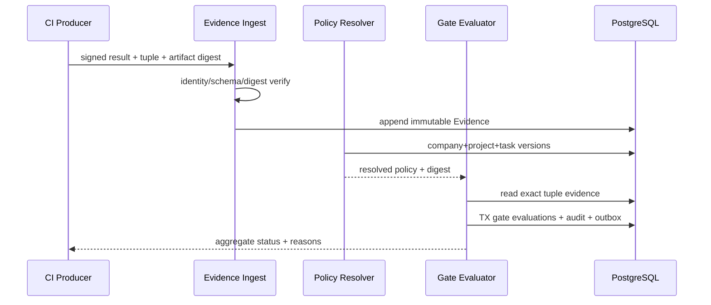
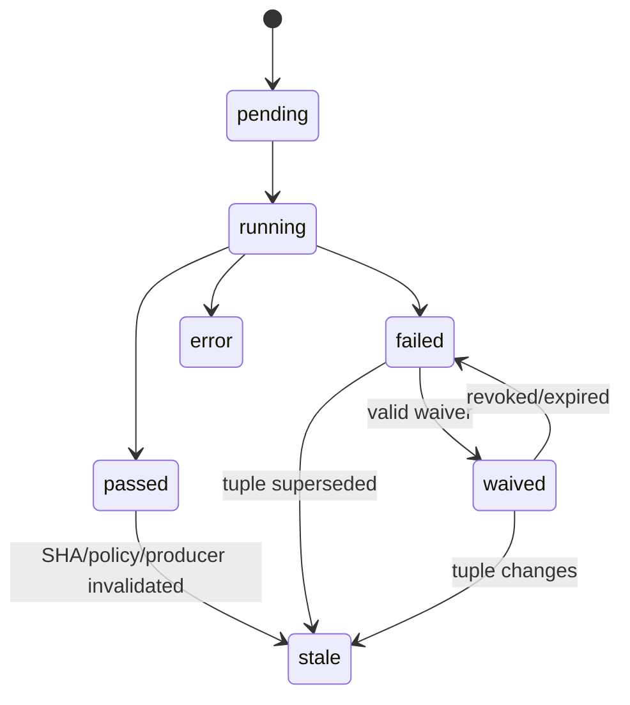

# Quality Policy、Evidence 与 Gate 引擎

> 当前实现说明：现有 `validation_runs`/`task_results` 记录部分本地检查，但没有版本化策略继承、权威 CI Evidence、SHA tuple、统一 Gate 状态、stale 传播或双人豁免；旧记录不能满足 v3 合并门禁。

## 1. 目标与非目标

- `EVD-REQ-001`：策略按“公司基线 → 项目只能加强 → Task 只能增加”确定性解析，下级 MUST NOT 关闭或放宽上级门禁。
- `EVD-REQ-002`：Evidence MUST 绑定 `source_sha + target_sha + pipeline_id + job_id + policy_version + producer + digest`，并标明 authority。
- `EVD-REQ-003`：Required Gate 仅 `passed` 或有效 `waived` 可满足；`missing/skipped/error/stale` 均阻断。
- 非目标：不把 Agent/Runner 自报结果作为 merge authority；不让 project/task 修改公司不可豁免规则。

## 2. 参与者、角色、权限和信任边界

platform_admin 发布公司基线；project_admin 只能加强项目策略；Coordinator 可为 Task 增加 check；CI Producer 签发权威 Evidence；Verifier 查看/驳回；Waiver requester 与 approver 必须不同；Agent 不能改策略、签 Evidence、自审或豁免。Policy/Evidence 输入都需 schema 和 producer 身份校验。

## 3. 触发条件、输入和前置条件

触发于策略发布、MR/source/target SHA 观察、pipeline/job Evidence、waiver 创建/撤销/到期、reconcile。前置：active policy chain 完整、项目/MR mapping 有效、source/target SHA 精确、producer 在允许列表、artifact digest 可验证。策略链任何层缺失或解析错误则 `policy_completeness=error`。

## 4. 正常交互及时序图

策略解析输出完整 effective policy、每条 rule provenance 与 canonical digest；Gate 聚合输出 check-by-check 状态和阻断原因，不得只输出布尔值。

## 5. 失败、取消、超时、重试、恢复和用户提示

无 Evidence 为 `missing`（内部聚合状态，不伪造 Evidence）；producer/API/解析异常为 `error`；主动取消为 `failed` 或 `error` 按 check 语义，绝不 passed。幂等 ingestion 可重试；同外部 job 不同 digest 标安全冲突。Waiver 到期/撤销即时重评。UI 显示 check、authority、source/target/pipeline/job、策略来源、observed_at、stale 原因、豁免人/到期时间和可执行修复。

## 6. 状态机、规则和不可变式

规范 Gate enum 固定为 `pending/running/passed/failed/error/stale/waived`；API 聚合 MAY 计算 `missing/skipped` 原因，但不得存成 passed。

- `EVD-INV-001`：Evidence append-only；修正通过新 attempt/supersedes，不覆盖 payload/digest。
- `EVD-INV-002`：source/target SHA、policy version 或 producer trust 改变，所有相关 Gate stale。
- `EVD-INV-003`：有效 waiver 只绑定单个 MR+source SHA+target SHA+check，最长 7 天，requester != approver。
- `EVD-INV-004`：身份隔离、SHA 一致、策略完整、Webhook 真实性不可豁免。

## 7. 字段、配置和格式校验

Policy 必含 `id/version/scope/status/effective_at/rules/digest`；rule 含 check ID、required、threshold、applicability、authority、waivable、severity。下级变更用单调关系验证：required 不能 true→false，阈值按 rule 方向只能更严，denylist 只能增，allowlist 只能减。Evidence 字段遵循固定 tuple，digest 使用 `sha256:<64hex>`。Waiver reason 20–2000 字符，expires_at <= created+7d，审批 actor 不得等于 requester/delegation owner。

## 8. 并发、幂等和一致性

Policy publish 使用 expected draft version 且单 scope 同时一个 active version；发布后 immutable。Evidence 唯一 external producer/job/check/attempt；Gate 以 tuple+resolved policy digest 唯一，异步 evaluator 可重复运行且结果相同。Waiver create/revoke 与 Gate 重评通过 Outbox；合并前 Connector 必须同步重新读取当前 SHA 与 aggregate Gate，消除 TOCTOU。

## 9. 安全、Secret、隐私和审计

Producer 使用 workload identity/签名，禁止客户端指定 authority；artifact 访问按项目/角色且短期 URL。策略发布、Evidence ingest/reject、Gate result/stale、waiver request/approve/revoke/expire 全审计。报告先脱敏，Secret Finding 不向普通 viewer 展示 payload；审计/摘要不含源码或 Secret。

## 10. 质量门禁、证据与 fail-closed 规则

默认 Required：baseline freshness、boundary、policy completeness、build、unit、lint/typecheck、适用 integration/contract、Secret Scan。严格基线：变更行覆盖率 >=80%；总覆盖率下降 <=0.5 个百分点；Critical/High SAST/依赖/镜像阻断；license denylist 阻断。Flaky Test 最多自动重跑一次，原失败保留，重跑成功仍需隔离或 waiver。

- `EVD-GATE-001`：缺任一 Required check 不进入 ready_for_human_merge。
- `EVD-GATE-002`：策略继承放宽或 provenance 缺失即 policy completeness failed/error。
- `EVD-GATE-003`：本地 diagnostic Evidence 不能满足 merge_gate authority。

## 11. 指标、SLO、告警和运维动作

监控 Evidence ingest/verify、Gate result/stale/missing、policy resolution、waiver age/use、flaky、producer errors。Required missing >5 分钟、同 job digest 冲突、不可豁免 check 出现 waiver、waiver 即将到期/异常激增立即告警。Gate 重评 P95 <10s（Evidence commit 后）。

## 12. 验收测试和需求追踪

| 测试 ID | 场景 |
| --- | --- |
| `TC-EVD-001` | 公司→项目→Task 单调继承与所有放宽攻击拒绝 |
| `TC-EVD-002` | exact tuple/authority/digest 校验及重复 ingestion |
| `TC-EVD-003` | source/target/policy 漂移即时 stale |
| `TC-EVD-004` | waiver 双人、单 tuple、7 天、撤销/过期、不豁免规则 |
| `TC-EVD-005` | missing/skipped/error/stale 均阻断 aggregate |

## 13. 数据迁移、兼容、发布与回滚

旧 ValidationRun 导入为 `legacy_local`、`authority=diagnostic`；为所有项目生成公司基线继承预览，由 project_admin 确认只可加强。先 shadow 计算 Gate，再 warning，最后阻断。Policy schema 版本升级使用新 version 与 re-evaluation，不原地修改。回滚 evaluator 时保留最新 Gate；无法理解新 policy/evidence 的旧版本必须把状态置 error，不得沿用旧 pass。
