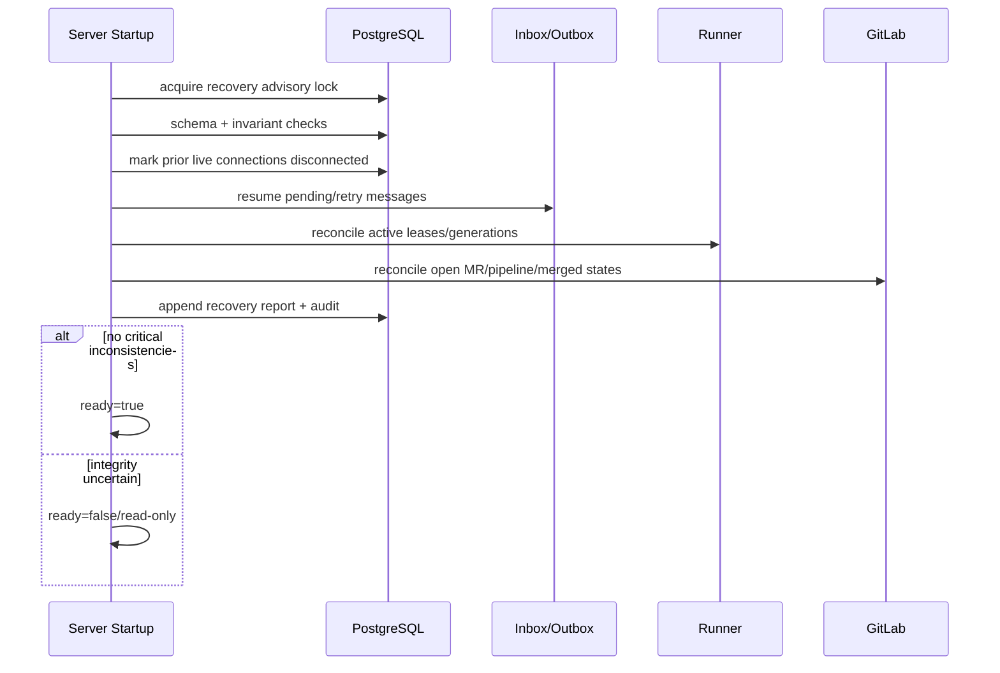

# 恢复、对账与故障补偿

> 当前实现说明：M0 RecoveryService 已在单一事务中失效上一进程的 Session/Lease，按中断阶段重排、取消或转 `needs_human`，以逐资源 expected version CAS 写入状态历史和队列版本，并校验 active Lease、执行状态、Worktree 安全性及外键不变量。新建 Worktree 的失败可清理并补偿；既有已修改或不确定 Worktree 会进入隔离/`cleanup_pending`，不会被不安全重派。任一步错误均回滚并阻止 readiness；schema catalog/integrity gate 在恢复前拒绝旧版、伪造或损坏数据库。只有持有数据库内核锁的单一 HTTP maintenance owner 可执行恢复和后台清理；并发第二 server fail-closed，本地 stdio Runner 只验证 schema，不执行迁移、全库恢复或 GC。重启恢复可重复执行并已有真实双进程、陈旧版本竞争和故障注入测试。Outbox/Inbox、Runner generation、GitLab 对账与 PostgreSQL 恢复锁仍属 M1/M2，因此本规范整体仍为 `partial/unverified`。

## 1. 目标与非目标

- `REC-REQ-001`：重启、崩溃、网络分区、重复/漏事件和部分外部副作用后 MUST 通过持久事实确定性恢复，不猜测成功。
- `REC-REQ-002`：恢复失败影响状态可信度时 readiness MUST 失败或进入只读降级；不得“记录错误继续写”。
- `REC-REQ-003`：恢复动作 MUST 幂等、可审计、可暂停/重放并保护 Evidence/Audit 历史。
- 非目标：不承诺撤销已由 GitLab 完成的 merge，不用数据库状态强行覆盖 GitLab 外部事实。

## 2. 参与者、角色、权限和信任边界

Startup Coordinator 执行本地一致性检查；Outbox/Inbox worker 重放；GitLab Reconciler 查询外部事实；Runner Reconciler 校验连接/Lease/workspace generation；operator 执行受权 runbook；PostgreSQL/对象存储/GitLab/Runner 均为独立故障域。只有 platform/operator 服务身份可触发全局恢复，项目级重试需相应权限。

## 3. 触发条件、输入和前置条件

触发于 server 启动、leader 变更、定时 reconcile、告警或 runbook。前置：schema 兼容、数据库可写/只读模式明确、系统时钟可信、恢复 lock、当前 binary/version、上次 clean shutdown marker。外部对账必须使用 credential_ref 与固定 mapping，不能使用缓存推断。

## 4. 正常交互及时序图

启动检查顺序：schema/DB integrity → clean shutdown marker → sessions/connections → Lease/Execution → Workspace intents → Inbox/Outbox → Gate stale → GitLab reconcile → audit report → readiness。

## 5. 失败、取消、超时、重试、恢复和用户提示

每个恢复 item 记录 `pending/running/succeeded/retry_wait/needs_human/failed_terminal`。仅幂等查询/补写可退避；未知外部副作用先查询再决定，不重复创建/推送。operator 取消只停止未开始 item，不回滚已确认事实。超时 item 进入 needs_human 并保持相关资源冻结。UI/doctor 展示影响资源、最后尝试、外部/内部观察值、建议 runbook，不输出 Secret。

## 6. 状态机、规则和不可变式

- Session/Runner 连接在进程重启后标 disconnected/offline，但 active Lease 保留至 expiry/reconcile，不能立即重派。
- active Lease 无有效 Runner：等待 expiry，Execution interrupted，之后 Task queued/needs_human 按副作用风险决定。
- Outbox pending/retry：继续投递；sending 超 lease 回 pending。Inbox processing 超 lease 回 retry_wait。
- MR/Pipeline/Task 差异：GitLab merged 可推进 done；内部 done 而 GitLab 未 merged 是 Critical integrity incident，不自动降级覆盖。

`REC-INV-001`：恢复只依据持久记录、Runner handshake、GitLab API/验签事件与对象 digest。  
`REC-INV-002`：迟到执行结果不推进新 generation。  
`REC-INV-003`：任何恢复不会删除/改写 Evidence/Audit/Inbox。  
`REC-INV-004`：每个补偿 action 有 causation ID 与幂等键。

## 7. 字段、配置和格式校验

RecoveryRun 含 binary/schema version、trigger、started/finished、scope、status、counts、critical issues；RecoveryItem 含 aggregate/project、observed internal/external version、action、attempt、deadline、result/error。恢复参数必须有 scope allowlist、max items、dry-run 默认 true；禁止用未解析 glob/root/HOME 作为 workspace cleanup target。

## 8. 并发、幂等和一致性

全局启动恢复使用 advisory lock；project reconcile 可分片但同 aggregate 单写。每个 item 唯一 `(run_id, action, aggregate_id, observed_version)`；执行前重读 version，变化则 skip/replan。Outbox/Inbox lease 防多 worker；GitLab reconcile 以 external updated_at/SHA 和内部 expected version写入。

## 9. 安全、Secret、隐私和审计

恢复/重放是高权限操作，必须 MFA/审批（按 runbook）、最小 scope 与完整审计；DLQ payload 展示脱敏。不得从日志恢复 Secret；凭据吊销后恢复不能绕过。可疑 Runner workspace 隔离保全证据，先吊销设备再清理。恢复报告加密、限制下载并设保留期。

## 10. 质量门禁、证据与 fail-closed 规则

- `REC-GATE-001`：startup invariant 或 schema check 失败，readiness=false。
- `REC-GATE-002`：crash points 覆盖每个事务/外部副作用边界，重启后一次业务效果。
- `REC-GATE-003`：数据库恢复、Runner 离线、GitLab 中断、DLQ 重放演练通过才可生产。
- `REC-GATE-004`：无法证明 source/target/Gate/merge 状态时冻结，不标 ready/done。

## 11. 指标、SLO、告警和运维动作

监控 recovery duration/items/result、invariant violations、reconcile drift/age、outbox/inbox retry/DLQ、orphan Lease/workspace、last clean shutdown。critical issue、内部 done/外部未 merge、恢复 run failed、DLQ>0、drift >5 分钟立即告警。PostgreSQL 目标 RPO 15 分钟、RTO 4 小时。

## 12. 验收测试和需求追踪

| 测试 ID | 场景 |
| --- | --- |
| `TC-REC-001` | 每个 commit/outbox/webhook/Runner ack crash point |
| `TC-REC-002` | 重复/漏失/乱序事件与 reconcile 一致 |
| `TC-REC-003` | active Lease 网络分区不双派，迟到结果隔离 |
| `TC-REC-004` | PostgreSQL PITR 后 Evidence/Audit/业务对账 |
| `TC-REC-005` | 恢复失败阻止 readiness，dry-run 无副作用 |

## 13. 数据迁移、兼容、发布与回滚

先修复旧 schema/RecoveryService 并增加 clean shutdown marker；迁移到 PostgreSQL 后旧 best-effort SQL 路径删除。发布新 recovery action 前需 dry-run report 与 chaos test。数据库迁移期间恢复程序必须理解前后两种 expand schema。回滚二进制前检查它能识别所有状态/action；不能识别则保持服务 stopped/read-only，使用 forward-fix，不做状态压缩映射。
