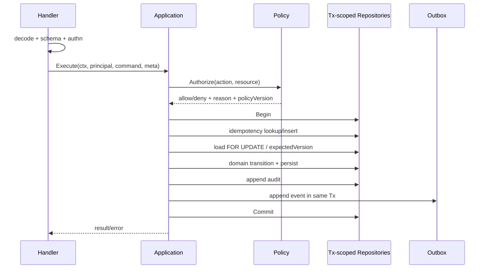

# 服务分层与事务边界

> 当前实现说明：M0 已建立单一 composition root，REST/MCP/WS 共用同一组应用服务；核心状态、Lease、恢复和验证写入由 Service 持有短事务，事务内使用 transaction-bound SQL，不再经基础 DB Store 重入。现有其他业务 Handler/Service 尚未全部收敛到 v3 command/query port，OIDC/RBAC、全局幂等、统一审计与 Outbox 插入点仍属 M1 改造。

## 1. 目标与非目标

- `SVC-REQ-001`：依赖方向 MUST 为 `Transport → Application → Domain`，Infrastructure 实现 Domain/Application port，禁止反向依赖。
- `SVC-REQ-002`：只有 Application Service 可拥有事务、授权、幂等、审计和 Outbox 生命周期。
- `SVC-REQ-003`：REST、MCP、WS command 与后台 job MUST 调用相同 command/query use case。
- 非目标：不强制引入复杂 DI 框架、事件溯源或微服务拆分；Go package 边界优先于运行时拆分。

## 2. 参与者、角色、权限和信任边界

| 层 | 职责 | 不得做 |
| --- | --- | --- |
| Handler/Transport | 协议解析、schema、认证上下文、错误映射 | 业务状态变更、拼 SQL、自主授权 |
| Application | use case、授权、事务、幂等、审计、Outbox | 执行任意外部脚本、信任客户端 scope |
| Domain | 聚合、状态机、不变量、policy input | 网络、数据库、当前用户全局变量 |
| Store Port/Adapter | project-scoped 持久化、锁/版本 | 隐式开启嵌套事务、跨 scope 查询 |
| Integration Adapter | GitLab/OIDC/Runner/Secret API | 改业务状态、绕过 Inbox/Outbox |

## 3. 触发条件、输入和前置条件

每个用例输入必须拆为 `PrincipalContext`（服务端）、`Command`（已过 schema）和 `RequestMeta`（correlation/idempotency/deadline）。Application 执行前验证 action、resource project、资源版本与幂等键。外部回调先持久化 Inbox，再由内部 command 消费。

## 4. 正常交互及时序图



推荐接口：

```go
type UnitOfWork interface {
  WithinTx(ctx context.Context, fn func(ctx context.Context, r Repositories) error) error
}
type Authorizer interface {
  Decide(ctx context.Context, p PrincipalContext, a Action, r Resource) (Decision, error)
}
```

事务回调中的 `Repositories` MUST 绑定同一 `*sql.Tx`；禁止在回调内使用基础 `*sql.DB` 或非 tx Store。

## 5. 失败、取消、超时、重试、恢复和用户提示

Handler 将 Domain/Application 错误映射为稳定 code；未知错误为 `INTERNAL_ERROR` 且仅返回 correlation ID。Context 取消必须传播到 DB/HTTP/Runner；提交已成功但响应丢失时由幂等记录恢复。只重试 serialization/deadlock/429/显式幂等外部读，最多 3 次；策略服务/审计写失败一律拒绝业务写。

## 6. 状态机、规则和不可变式

- `SVC-INV-001`：`Authorize → Tx idempotency → load/lock → domain validate → persist → audit → outbox → commit` 顺序不可调整。
- `SVC-INV-002`：deny 也 MUST 审计，但不得创建业务/Outbox 副作用。
- `SVC-INV-003`：Domain transition 接收 actor、当前状态与事实，不读取系统全局时间；时间由 Clock port 注入。
- `SVC-INV-004`：Integration response 只能作为待验证事实输入新事务，不跨网络调用持有 DB 事务。

## 7. 字段、配置和格式校验

Transport 负责 wire schema、长度、enum、unknown field；Application 负责跨字段与权限；Domain 负责状态不变量；DB 负责最后唯一/FK/check。command 不得含 role、可信 session、策略结果。字符串统一 Unicode NFC，标题 1–200 字符，reason 1–2000，幂等键 16–128 可打印 ASCII，版本为非负整数。

## 8. 并发、幂等和一致性

单聚合写使用 expected version；多聚合按 `project → work_item → lease → execution → evidence/gate` 固定锁顺序。不得在事务内发布 WebSocket、调用 GitLab 或启动 Runner；Outbox dispatcher 负责至少一次投递。幂等响应必须包含相同 HTTP/MCP 结果摘要，request hash 不同则冲突。

## 9. 安全、Secret、隐私和审计

Application 只接收 Secret reference；Integration 在最后责任时刻解析并立刻清零/释放。日志 adapter 强制字段 allowlist 与脱敏。审计字段包括 actor/delegation、role、team/project、action/resource、decision/reason、correlation、IP、token/runner hash、before/after version；不存源码与 Secret。

## 10. 质量门禁、证据与 fail-closed 规则

- `SVC-GATE-001`：静态依赖测试禁止 Handler 导入 store/integration，Domain 导入网络/SQL 包。
- `SVC-GATE-002`：所有写 use case 的 contract test 必须证明 authorize、idempotency、audit、outbox 顺序和回滚。
- `SVC-GATE-003`：事务回调内调用基础 DB 的检测/测试必须失败。
- mock authorization 只允许单元测试；集成测试使用真实 policy matrix，默认 deny。

## 11. 指标、SLO、告警和运维动作

按 use case 记录 duration、result、retry、tx duration、policy latency、idempotency hit 与 outbox append；不得用 principal/project 作为高基数 metric label。事务 P95 > 500ms、deadlock 突增、审计/Outbox append 失败立即告警。

## 12. 验收测试和需求追踪

| 测试 ID | 场景 |
| --- | --- |
| `TC-SVC-001` | REST 与 MCP 同一 command 返回等价状态/错误/审计 |
| `TC-SVC-002` | 事务中后置 audit/outbox 失败导致业务行回滚 |
| `TC-SVC-003` | 并发 expected version 冲突稳定返回 409 |
| `TC-SVC-004` | 未授权请求无业务副作用且有 deny 审计 |
| `TC-SVC-005` | 外部 GitLab 超时期间不持有数据库事务 |

每个 Application command 必须在追踪矩阵关联 Requirement、Permission、Audit Event、API/MCP schema 与 test。

## 13. 数据迁移、兼容、发布与回滚

改造顺序：提取 Domain 状态机 → 为 Store 引入 tx-scoped Repository → 建 Application command/query → REST/MCP 双跑结果比较 → 移除旧直连 Service 路径。过渡适配器 MUST 标 `deprecated` 并有删除版本；禁止新功能走旧路径。回滚可切换 transport routing 到旧 query-only 入口，但涉及写事务的一旦切换到新 schema 不得双写或回退为无审计旧实现。
