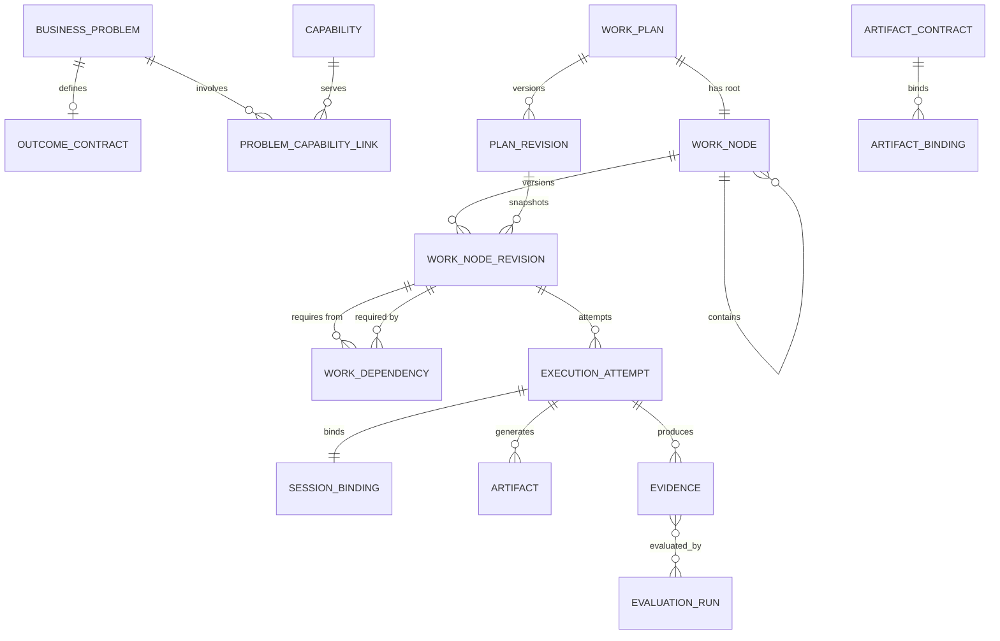

# Work Graph 数据模型

> 落地状态（2026-09-10，随 ADR-009 批准与 J2a 切片）：迁移 0017 落地四类关系分表（`work_nodes` 邻接承载 contains、`work_dependencies` 承载 requires、`node_artifact_flows` 承载 consumes/produces、`node_lineage` 承载血缘）、封板不可变（`plan_revisions` 封板后触发器禁改、`work_node_revisions` 仅插入）、图/节点 CAS、资产台账（`assets` + `asset_gate_bindings`）与 `maestro asset-intake` 存量摄取命令。未落地：拆解协议与封板编排、Intent 层表（business_problems / outcome_contracts / capabilities）、ExecutionAttempt/SessionBinding 五元组绑定、聚合纯函数与调度（以上 J2b）；MCP 工具与控制台面（J2c）。既有平面路径并存：Task 的 ParentTaskID 与单值 RelationType 不动，Feature/Task 切换写入是后续契约仪式的独立决策。

## 1. 目标与非目标

`WGM-REQ-001`：四类关系 MUST 分表分语义：contains（唯一父子归属树，邻接列 `work_nodes.parent_node_id` 承载）、requires（无环执行依赖 DAG，`work_dependencies`）、consumes/produces（Artifact 数据流，`node_artifact_flows`）、lineage（followup_of/replacement_of 血缘，`node_lineage`）。`WGM-REQ-002`：模型 MUST 分四层：Intent（BusinessProblem/OutcomeContract/Capability）、Plan（WorkPlan/WorkNode/Revision）、Runtime（ExecutionAttempt/SessionBinding/ContextSet）、Evidence（Artifact/Evidence/PROV 血缘）；Intent 与 Runtime 层表随 J2b 拆解协议落地，平面路径的 `leases`/`executions` 继续服务存量执行。`WGM-REQ-003`：标识体系 MUST 同时保留 UUIDv7 实体 ID、人类可读编号、slot_key 与 spec_digest，且互不复用。`WGM-REQ-004`：PostgreSQL 关系模型 MUST 是唯一权威写库；树视图、关键路径与 provenance 只作投影。`WGM-REQ-005`：资产台账 MUST 机检注册规则（必填字段、类型在目录内、digest 由台账计算、supersede 目标存在且未被替换），每次流转与 `asset.registered/reviewed/approved/superseded` 审计事件同事务提交；confidential 存量仅摘要+文件指针+digest，正文不入库。非目标：不定义排序策略与领取协议（WGS 范围）；不引入图数据库或自动规划求解器；不定义制品类型目录与试点治理流程（工作层 ARTIFACT-STANDARDS 持有，经 ADR-009 评审进入权威引用）。

## 2. 参与者、角色、权限和信任边界

Application Service 以最小权限 DB role 访问业务表；migration role 单独持有 DDL；审计导出只读追加分区。Agent、Runner、浏览器与 GitLab 不得直连数据库。改图与状态投影只发生在服务端事务内；客户端提交的拆分提议是不可信输入，必须全文校验。资产内容文件存试点仓 `assets/<asset_id>/`（git 版本控制），Maestro 台账只存 digest、指针与摘要行，不驻留内容 blob。

## 3. 触发条件、输入和前置条件

建模或改图要求：ADR-009 已批准（2026-09-10，四方）、对应机器规范已同步、项目策略含深度/扇出上限。迁入历史数据要求：来源 digest、行数、ID 映射与隔离清单齐备；语义不明的父子关系进入 needs_reconcile，不得猜测迁入。存量制品摄取要求：内容文件可定位、digest 可计算、confidential 项只允许指针模式。

## 4. 正常交互及时序图

上图为目标全景；0017 落地映射：WORK_PLAN→`work_plans`、PLAN_REVISION→`plan_revisions`、WORK_NODE→`work_nodes`、WORK_NODE_REVISION→`work_node_revisions`、WORK_DEPENDENCY→`work_dependencies`、ARTIFACT/ARTIFACT_CONTRACT 的试点投影→`assets`（台账）与 `node_artifact_flows`（产物流边）、血缘分表→`node_lineage`、平面 WorkItem 的 Gate 消费桥→`asset_gate_bindings`。BUSINESS_PROBLEM/OUTCOME_CONTRACT/CAPABILITY/EXECUTION_ATTEMPT/SESSION_BINDING/EVIDENCE 关联表随 J2b/J2c。

事务写序：校验输入与授权 → 图/节点版本 CAS → 业务行 → AuditEvent → OutboxEvent → commit；外部副作用只能由 commit 后 dispatcher 执行。

## 5. 失败、取消、超时、重试、恢复和用户提示

改图在版本冲突时整体失败并要求基于最新图重放，不部分写入。迁入对账不一致停在 dry-run/quarantine。上游 spec、artifact、policy 或 SHA 变化使下游 Context 与 Evidence 全部标记 stale 并阻断宣称完成：制品 supersede 使 `asset_gate_bindings` 转 stale 并阻断依赖该制品的 WorkItem 领取（0017）；SHA/policy 漂移沿用 `gate_snapshots` 既有 stale 语义（QG-RULE-003）。恢复时依据 Attempt 绑定重建执行上下文；无法恢复的转入 needs_human 并给出稳定原因。

## 6. 状态机、规则和不可变式

节点类型固定为 WorkPackage（结构聚合，不可领取 Lease）、WorkItem（原子可执行，沿用任务状态机）、Gate/Decision（由证据判定，不由 Agent 完成）。计划生命周期 draft→proposed→sealed→executing→aggregating→satisfied/failed/needs_human（含 replanned 分支）；资产生命周期 draft→reviewed→approved→superseded，回退=新版本。不变量：

- `WGM-INV-001`：每个 sealed WorkPlan 恰有一个 root；非根节点恰有一个父节点。
- `WGM-INV-002`：root_id 创建后不可变；所有节点与边同 project（边经同 plan 外键结构保证）。
- `WGM-INV-003`：requires 图无环；只有可执行节点进入该图。
- `WGM-INV-004`：required input port 必须绑定且 Schema 与版本兼容。
- `WGM-INV-005`：每个 WorkItem 同时最多一个 active Attempt/Lease。
- `WGM-INV-006`：Attempt 固定绑定 node_revision、session、worker、worktree 与 context_digest。
- `WGM-INV-007`：重试创建新 Attempt；follow-up/replacement 创建新 WorkNode 并记录 lineage。
- `WGM-INV-008`：sealed Revision 不可原地修改。
- `WGM-INV-009`：上游变更必须使下游 Context 与 Evidence stale。
- `WGM-INV-010`：父节点成功必须包含独立 Integration/Evaluation 证据。
- `WGM-INV-011`：跨 WorkPlan 依赖只导入不可变 Artifact Snapshot，不建立可传播取消的实时边。
- `WGM-INV-012`：图变更、Audit 与 Outbox 同事务提交。
- `WGM-INV-013`：资产状态流转只允许 draft→reviewed→approved→superseded；修订以新版本行承载，同一版本行内容字段不可变。
- `WGM-INV-014`：supersede 链单后继——同一 (asset_id, version) 至多被一个后继版本替换。
- `WGM-INV-015`：locked_gate 消费 fail-closed——制品非 approved、digest 与绑定不一致或绑定已 stale 时 WorkItem 不可领取；制品 supersede 自动使下游绑定 stale。

0017 执行层映射（双层机检：数据库约束/触发器 + 应用守卫）：

| 不变量 | 0017 执行层 | 备注 |
| --- | --- | --- |
| WGM-INV-001 | `UNIQUE NULLS NOT DISTINCT (plan_id, parent_node_id, slot_key)` + 应用守卫 | 根与非根同约束 |
| WGM-INV-002 | 触发器禁改 `parent_node_id`/`node_type`/`slot_key` | 边同 plan 由外键结构保证 |
| WGM-INV-003 | 应用层环检测（`ErrCircularDependency`） | PG 约束不可表达 DAG 无环，已知边界 |
| WGM-INV-004 | 封板校验（应用层） | J2b 拆解协议强化为端口级 |
| WGM-INV-005 | 既有 `one_active_lease` 部分唯一索引（平面路径） | 图路径 Attempt 随 J2b |
| WGM-INV-006/010/011 | 未落地 | J2b（Attempt 五元组/聚合纯函数/跨计划快照） |
| WGM-INV-007 | `node_lineage.kind` CHECK + 应用守卫 | retry_of 随 Attempt 表 J2b |
| WGM-INV-008 | 触发器：`plan_revisions` 封板后禁 UPDATE/DELETE；`work_node_revisions` 全程仅插入 | |
| WGM-INV-009 | 资产 supersede→绑定 stale（同事务）；SHA/policy 漂移走 `gate_snapshots` stale | |
| WGM-INV-012 | 应用层单事务模式（状态行+审计行+outbox 同 commit） | |
| WGM-INV-013/014 | 状态 CHECK、内容列不可变触发器、`supersedes_ref` 部分唯一索引 | |
| WGM-INV-015 | 领取查询 fail-closed + `asset_gate_bindings.status` | |

## 7. 字段、配置和格式校验

实体 ID 为 UUIDv7（应用侧铸造）；人类可读编号 `MST-WP-<5位十进制>` / `MST-WI-<5位十进制>`，项目内唯一、不携带父路径与能力语义，重新归类不改变编号。slot_key 匹配 `^[a-z][a-z0-9.]{0,63}$`（小写点分，每段以字母开头），在 (plan, parent_node, slot) 三元组内唯一。spec_digest 对规范化后的 scope、baseline、输入输出 Contract、验收条件、策略与模板版本计算：键排序、无多余空白的规范化 JSON 之 sha256，形如 `sha256:<64hex>`，仅用于 stale 判断不作实体 ID。资产：asset_id 匹配 `^ART-[a-z-]+-[0-9]{3,}$`（类型码取工作层制品目录）；version 为从 1 起的正整数；`source_digest` 匹配 `^sha256:[0-9a-f]{64}$` 且由台账在注册/摄取时对内容计算，拒绝自报；sensitivity 取 public/internal/confidential；supersedes_ref 形如 `<asset_id>@<version>`。semantic_fingerprint 仅产生重复候选告警。WorkPackage 与 Gate 节点类型不可领取 Lease；叶子 WorkItem 必须满足原子性谓词：一个主要业务责任、一个 owning capability、一个仓库与精确 baseline SHA、一个独立工作区边界、一个可判定输出契约、一个预算与超时边界（J2b 拆解协议校验）。

## 8. 并发、幂等和一致性

图结构变更（加节点/加依赖/加血缘/加产物流边/封板）携带 expected_graph_version，节点状态变更携带 expected_node_version；均为受守卫 UPDATE 的 CAS，冲突整体失败要求基于最新图重放。拆分、封板、重规划与取消均幂等。依赖用规范化 edge table；归属树用邻接表并冗余不可变 root/depth 列；ltree 仅作查询投影，路径不得成为业务身份。聚合结果与关键路径从同一图快照重算（J2b）。资产流转幂等：重复的同向流转返回既有行不重复审计。

## 9. 安全、Secret、隐私和审计

ContextSet 记录文件白名单、token 预算与 digest；ResultCapsule 只含结构化结果，不含原始 transcript。Evidence 与 provenance 采用 W3C PROV 的 Entity、Activity、Agent、used、generated、derived-from 结构，支持重放与责任追踪。Attempt 绑定与 lineage 变更全审计；Secret 不入库、不进 Prompt。资产台账：confidential 存量（会话记录等）仅摘要+文件指针+digest，正文既不入库也不入试点仓 assets 目录；`asset.registered/reviewed/approved/superseded` 四事件随状态变更同事务进 append-only 审计链，事件体携带 asset_id@version 与操作主体。

## 10. 质量门禁、证据与 fail-closed 规则

`WGM-GATE-001`：迁移 cutover 前影子构图与旧模型双读对账必须零差异。`WGM-GATE-002`：Schema 变更必须过 schema catalog 的版本、名称与 digest 校验；对账或校验失败一律 fail-closed 停在隔离区。`WGM-GATE-003`：台账机检拒绝必须可测——类型目录外、digest 格式非法、状态跳跃流转、supersede 目标不存在或已被替换，均拒绝且返回稳定错误。Evidence 权威性规则沿用既有质量体系，本地诊断证据不得作为最终门禁。

## 11. 指标、SLO、告警和运维动作

跟踪改图冲突率、迁移对账差异、needs_reconcile 存量、stale 传播深度、provenance 查询延迟、stale 资产绑定数与 supersede 频次（台账可查）。对账不一致、不变量破坏尝试、影子构图失败或 stale 绑定长期滞留必须告警并阻断切换；告警生产者随 J2b 调度接入，J2a 提供查询面。

## 12. 验收测试和需求追踪

- `TC-WGM-001`：环检测、唯一父约束与跨 project 边拒绝 → J2a PG 门控（`postgres_workgraph_test.go`）。
- `TC-WGM-002`：sealed Revision 不可变（触发器拒绝 UPDATE/DELETE）；CAS 冲突整体失败 → J2a PG 门控。
- `TC-WGM-003`：上游制品 supersede 后下游绑定 stale 且领取 fail-closed → J2a PG 门控（`postgres_assets_test.go`）。
- `TC-WGM-004`：迁移中语义不明的 ParentTaskID 进入 needs_reconcile，不产生猜测边 → contract 切片（后续）。
- `TC-WGM-005`：Attempt 绑定五元组完整且恢复后不变 → J2b。
- `TC-WGM-006`：台账机检拒绝族（WGM-GATE-003）→ J2a PG 门控。

阶段任务与追踪矩阵行按 W4.5 J 系列任务书登记（J2a：模型与台账存储；J2b：协议与调度；J2c：MCP 面），矩阵行在 V4 收敛仪式统一翻转；翻转前不得作为实现完成或验证通过的依据。本文档批准记录见 ADR-009 评审记录（2026-09-10 四方）。

## 13. 数据迁移、兼容、发布与回滚

最小语义映射：Feature → WorkPlan（补 synthetic Problem/Outcome，J2b）；Task → WorkItem；Dependencies JSON → WorkDependency；Role → ExecutionRequirement（不是 Capability）；AssignedSessionID/WorkerID → ExecutionAttempt/SessionBinding（J2b）；TaskResult → ResultCapsule/Artifact；ValidationRun → Evidence/EvaluationRun；AgentSession → 运行时连接实体。采用 expand/contract 五步：**新增表（J2a，迁移 0017 纯增量九表）** → 影子构图 → 双读对账 → 切换写入 → 删除旧字段；后四步是后续契约仪式的独立决策，0017 不触碰任何既有表与列。资产台账随 0017 落地（`assets`/`asset_gate_bindings`），存量摄取走 `maestro asset-intake` 三模式（原文注册/digest+摘要/指针）。回滚只能回到上一已批准 v3 提交并同步回滚规范与追踪状态。
