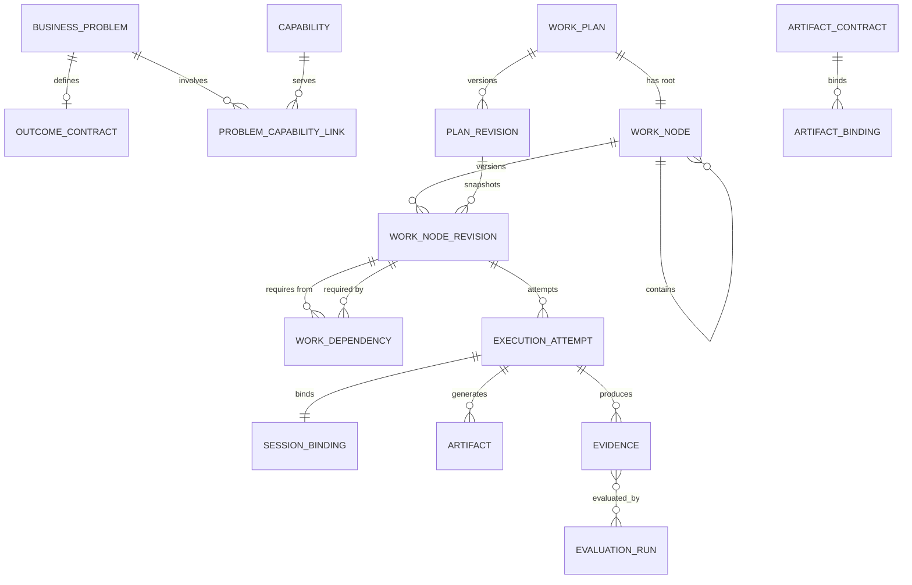

# Work Graph 数据模型

> 当前实现说明：Task 将依赖存为 JSON，ParentTaskID 与单值 RelationType 并存，Session/Worker 直接覆盖在 Task 当前状态上；follow-up 因缺少父版本与幂等约束被禁用。本文定义 M1 目标模型，未实现。

## 1. 目标与非目标

`WGM-REQ-001`：四类关系 MUST 分表分语义：contains（唯一父子归属树）、requires（无环执行依赖 DAG）、consumes/produces（Artifact Contract 数据流）、lineage（retry_of/followup_of/replacement_of 血缘）。`WGM-REQ-002`：模型 MUST 分四层：Intent（BusinessProblem/OutcomeContract/Capability）、Plan（WorkPlan/WorkNode/Revision）、Runtime（ExecutionAttempt/SessionBinding/ContextSet）、Evidence（Artifact/Evidence/PROV 血缘）。`WGM-REQ-003`：标识体系 MUST 同时保留 UUIDv7 实体 ID、人类可读编号、slot_key 与 spec_digest，且互不复用。`WGM-REQ-004`：PostgreSQL 关系模型 MUST 是唯一权威写库；树视图、关键路径与 provenance 只作投影。非目标：不定义排序策略与领取协议；不引入图数据库或自动规划求解器。

## 2. 参与者、角色、权限和信任边界

Application Service 以最小权限 DB role 访问业务表；migration role 单独持有 DDL；审计导出只读追加分区。Agent、Runner、浏览器与 GitLab 不得直连数据库。改图与状态投影只发生在服务端事务内；客户端提交的拆分提议是不可信输入，必须全文校验。

## 3. 触发条件、输入和前置条件

建模或改图要求：ADR-009 已批准、对应机器规范已同步、项目策略含深度/扇出上限。迁入历史数据要求：来源 digest、行数、ID 映射与隔离清单齐备；语义不明的父子关系进入 needs_reconcile，不得猜测迁入。

## 4. 正常交互及时序图

事务写序：校验输入与授权 → 图/节点版本 CAS → 业务行 → AuditEvent → OutboxEvent → commit；外部副作用只能由 commit 后 dispatcher 执行。

## 5. 失败、取消、超时、重试、恢复和用户提示

改图在版本冲突时整体失败并要求基于最新图重放，不部分写入。迁入对账不一致停在 dry-run/quarantine。上游 spec、artifact、policy 或 SHA 变化使下游 Context 与 Evidence 全部标记 stale 并阻断宣称完成。恢复时依据 Attempt 绑定重建执行上下文；无法恢复的转入 needs_human 并给出稳定原因。

## 6. 状态机、规则和不可变式

节点类型固定为 WorkPackage（结构聚合，不可领取 Lease）、WorkItem（原子可执行，沿用任务状态机）、Gate/Decision（由证据判定，不由 Agent 完成）。不变量：

- `WGM-INV-001`：每个 sealed WorkPlan 恰有一个 root；非根节点恰有一个父节点。
- `WGM-INV-002`：root_id 创建后不可变；所有节点与边同 project。
- `WGM-INV-003`：requires 图无环；只有可执行节点进入该图。
- `WGM-INV-004`：required input port 必须绑定且 Schema 与版本兼容。
- `WGM-INV-005`：每个 WorkItem 同时最多一个 active Attempt/Lease。
- `WGM-INV-006`：Attempt 固定绑定 node_revision、session、worker、worktree 与 context_digest。
- `WGM-INV-007`：重试创建新 Attempt；follow-up/replacement 创建新 WorkNode 并记录 lineage。
- `WGM-INV-008`：sealed Revision 不可原地修改。
- `WGM-INV-009`：上游变更必须使下游 Context 与 Evidence stale。
- `WGM-INV-010`：父节点成功必须包含独立 Integration/Evaluation 证据。
- `WGM-INV-011`：跨 WorkPlan 依赖只导入不可变 Artifact Snapshot，不建立可传播取消的实时边。
- `WGM-INV-012`：图变更、Audit 与 Outbox 同事务提交。

## 7. 字段、配置和格式校验

实体 ID 为 UUIDv7；编号格式 MST-WP-xxxxx / MST-WI-xxxxx；slot_key 为小写点分且满足按 plan_revision、parent_node、slot 的唯一约束；spec_digest 对规范化后的 scope、baseline、输入输出 Contract、验收条件、策略与模板版本计算，仅用于 stale 判断。semantic_fingerprint 仅产生重复候选告警。WorkPackage 与 Gate 节点类型不可领取 Lease；叶子 WorkItem 必须满足原子性谓词：一个主要业务责任、一个 owning capability、一个仓库与精确 baseline SHA、一个独立工作区边界、一个可判定输出契约、一个预算与超时边界。

## 8. 并发、幂等和一致性

图结构变更携带 expected_graph_version，节点状态变更携带 expected_node_version；拆分、封板、重规划与取消均幂等。依赖用规范化 edge table；归属树用邻接表并冗余不可变 root_id/depth；ltree 仅作查询投影，路径不得成为业务身份。聚合结果与关键路径从同一图快照重算。

## 9. 安全、Secret、隐私和审计

ContextSet 记录文件白名单、token 预算与 digest；ResultCapsule 只含结构化结果，不含原始 transcript。Evidence 与 provenance 采用 W3C PROV 的 Entity、Activity、Agent、used、generated、derived-from 结构，支持重放与责任追踪。Attempt 绑定与 lineage 变更全审计；Secret 不入库、不进 Prompt。

## 10. 质量门禁、证据与 fail-closed 规则

`WGM-GATE-001`：迁移 cutover 前影子构图与旧模型双读对账必须零差异。`WGM-GATE-002`：Schema 变更必须过 schema catalog 的版本、名称与 digest 校验；对账或校验失败一律 fail-closed 停在隔离区。Evidence 权威性规则沿用既有质量体系，本地诊断证据不得作为最终门禁。

## 11. 指标、SLO、告警和运维动作

跟踪改图冲突率、迁移对账差异、needs_reconcile 存量、stale 传播深度和 provenance 查询延迟。对账不一致、不变量破坏尝试或影子构图失败必须告警并阻断切换。

## 12. 验收测试和需求追踪

- `TC-WGM-001`：环检测、唯一父约束与跨 project 边拒绝。
- `TC-WGM-002`：sealed Revision 不可变；聚合事件重放结果一致。
- `TC-WGM-003`：上游 SHA/契约变更后下游 Context 与 Evidence 全部 stale。
- `TC-WGM-004`：迁移中语义不明的 ParentTaskID 进入 needs_reconcile，不产生猜测边。
- `TC-WGM-005`：Attempt 绑定五元组完整且恢复后不变。

阶段任务与追踪矩阵行待 M1 任务书更新时登记；登记前本文保持 draft。

## 13. 数据迁移、兼容、发布与回滚

最小语义映射：Feature → WorkPlan（补 synthetic Problem/Outcome）；Task → WorkItem；Dependencies JSON → WorkDependency；Role → ExecutionRequirement（不是 Capability）；AssignedSessionID/WorkerID → ExecutionAttempt/SessionBinding；TaskResult → ResultCapsule/Artifact；ValidationRun → Evidence/EvaluationRun；AgentSession → 运行时连接实体。采用 expand/contract 五步：新增表 → 影子构图 → 双读对账 → 切换写入 → 删除旧字段。回滚只能回到上一已批准 v3 提交并同步回滚规范与追踪状态。
