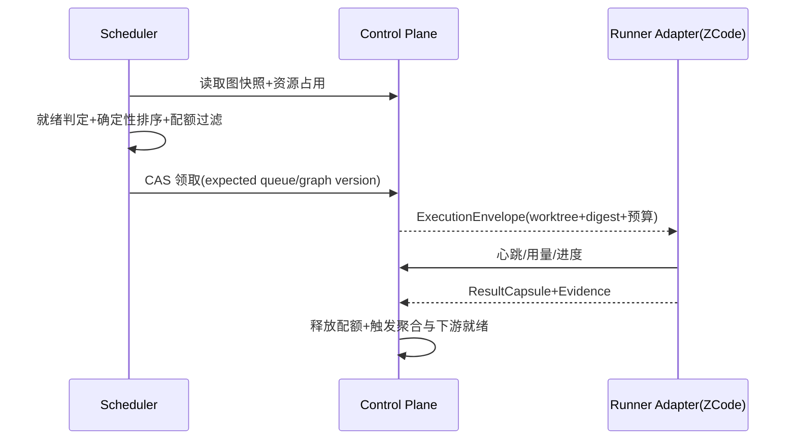

# Work Graph 调度器

> **定稿（2026-09-10，任务书 J2b；ADR-009 W4.5 激活其二）**。J2a（2026-09-10）落地模型与存储（迁移 0017）；J2b 随本文定稿落地拆解协议与调度核心（迁移 0019 + `internal/workgraph` 纯协议包 + `internal/store` 图路径执行面）：DecompositionProposal 四类校验与稳定错误码（WGP-VS/WGP-CY/WGP-BU/WGP-RS 四族）、封板/重规划（sealed 不可变、spec 变更节点复位、旧 Attempt 钉住旧 NodeRevision+spec_digest）、图路径领取（就绪合取 + 确定性排序 + 队列 CAS + 幂等键）、ExecutionEnvelope、ExecutionAttempt 五元组绑定（触发器级不可变）、预算台账集成（work_node 作用域、剩余额度预约、fail-closed）、心跳/完成围栏、Lease 过期清扫与重试血缘、聚合纯函数投影（internal/workgraph.Aggregate）与取消投影（cancel_policy）。
>
> **未实现面（如实登记）**：三级并发配额（项目/父节点/Runner）与资源 concurrency key 互斥、背压水位信号、Worker 亲和选择键、Adapter 会话续接（TC-WGS-003 的"原 Attempt 续接"）、心跳/用量的 MCP/HTTP 暴露面（J2c）、恢复扫描的常驻调度循环（现为 store 级 `ExpireStaleWorkNodeAttempts`，由上层周期调用）。旧平面路径（`get_next_task`/`runner-leases/claim`→work_items）与新图路径并存，切换写入是后续契约仪式。

## 1. 目标与非目标

`WGS-REQ-001`：就绪判定 MUST 是合取：节点所在 PlanRevision 已 sealed、全部 required 依赖 outcome 满足、required artifact 存在且未 stale、能力与权限匹配、预算已预留、资源预留成功。`WGS-REQ-002`：调度 MUST 使用确定性排序，同图快照重放结果一致。`WGS-REQ-003`：领取 MUST 返回统一 ExecutionEnvelope：Task、Lease、精确 worktree 路径、generation、base SHA、context digest 与预算。`WGS-REQ-004`：失败与取消 MUST 按计划策略传播，跨计划边界不传播实时取消。非目标：不定义聚合语义与数据 Schema（WGM/WGP 范围）；当前规模不引入 min-cost max-flow 等全局优化求解器。

## 2. 参与者、角色、权限和信任边界

调度器是服务端独占组件；Worker 不能自选任务或自报身份范围，principal/project/role 由服务端会话绑定决定（图路径领取入参由服务端会话上下文填充，幂等键与连接代际由 Worker 呈现）。ZCode/Codex Runner Adapter 负责以领取到的 worktree 为 CWD 启动、恢复、取消对应 Agent 会话并归一化事件、心跳、用量与结果。评价与执行职责分离：执行 Agent 的产出必须经独立 Gate/Evaluator 判定——succeeded Attempt 只把节点推进到 validating，`done` 只能由证据/Gate 路径写入。

## 3. 触发条件、输入和前置条件

调度触发：PlanRevision seal、Attempt 结束、Lease 过期回收、心跳注册、恢复扫描与策略变更。输入至少包含图快照版本、队列版本与资源占用表；缺失时调度循环跳过本轮并告警，不得用部分数据决策。J2b 落地形态：领取携带 expected queue version（projects.version CAS）+ idempotency key；过期回收为 `ExpireStaleWorkNodeAttempts` 扫描（释放预约、节点回 queued、记审计），由上层周期或事件驱动调用。

## 4. 正常交互及时序图

图路径 J2b 实现映射：CAS 领取=节点行 FOR UPDATE SKIP LOCKED + node_version CAS + 队列 token 前进；ExecutionEnvelope=execution_attempts 行 + spec 装配（task_id/human_code、node_revision_id、attempt_id、lease_token+epoch、workspace_path、generation、base_sha、context_digest、budget、correlation_id，全部必填非空）；完成=CompleteWorkNodeAttempt（围栏 + 结果胶囊 + 预算结算 spend/全量 release + 节点投影 + 审计/outbox 同事务）。

## 5. 失败、取消、超时、重试、恢复和用户提示

Lease 过期即回收：`ExpireStaleWorkNodeAttempts` 把过期 running Attempt 置 expired、释放其预算预约、节点回 queued（重试=新 Attempt，retry_of 指向前驱，WGM-INV-007）；已产生副作用的续接由 Adapter 按原绑定恢复（五元组触发器不可变保证绑定可重建），无法续接的转 needs_human 并显示原因——续接执行面属 Adapter/J2c 接入，本文如实标注 partial。队列积压超过水位触发背压：暂停接收新拆分提议或降低 fan-out 上限（背压信号面未实现）。取消按计划 cancel_policy 投影：`CancelWorkNode` 以被取消节点 spec 的 cancel_policy 对 requires 可达后代做取消/分离（cascade_required=全后代取消；detach_optional=required 脊取消、optional-only 后代分离并审计；none=不传播）；cancelled 节点永不重排（WGS-RULE-005）。超时按预算边界停止并记录用量。

## 6. 状态机、规则和不可变式

任务排序键（J2b 实现集）：spec.priority 降序（缺省 0）、spec.deadline 升序（缺省最后）、work_nodes.created_at 升序、node_id 升序——全部取自存储数据，纯函数可重放。Worker 选择键（resume_affinity/repository_affinity/current_load/worker_id）未实现：当前领取不选 Worker，由调用方身份与能力集过滤（owning_capability ∈ 呈现能力集；Role 不得当 Capability）。

- `WGS-RULE-001`：调度决策必须是图快照的纯函数，重放得到相同结果（候选查询全取存储列，无随机/时钟项；聚合投影为纯函数并有性质测试）。
- `WGS-RULE-002`：项目、父节点与 Runner 三级并发配额 MUST 强制生效（未实现——当前唯一生效的并发闸是"节点单活跃 Attempt"部分唯一索引与 SKIP LOCKED；三级配额登记为后续切片）。
- `WGS-RULE-003`：资源 concurrency key（如同仓库写路径）互斥 MUST 强制生效（未实现，后续切片）。
- `WGS-RULE-004`：能力路由按 ExecutionRequirement 匹配；Role 不得当 Capability（已实现最小面：owning_capability 精确匹配；完整能力路由声明与工具面随 J2c）。
- `WGS-RULE-005`：cancelled 节点不得被再次调度；重试走新 Attempt（已实现：领取候选限定 status='queued'，cancelled 永不回 queued；重试 attempt_no+1 且 retry_of 链接）。

## 7. 字段、配置和格式校验

ExecutionEnvelope 字段（J2b 全量实现）：task_id、node_revision_id、execution_attempt_id、lease_token 与 epoch、workspace_path、generation、base_sha、context_digest、budget、correlation_id；全部必填且不可为空。心跳间隔、Lease 时长、配额默认值与上限来自版本化项目策略；策略未知时使用最保守默认（当前为调用方传入 TTL，缺省 90s；策略表未实现）。排序键类型固定且可比较。ContextSet（ADR-009 §9 最小上下文）= repo + 精确 base SHA + 目录边界 + 直接依赖制品（带 digest）+ 验收条件 + 预算；context_digest 为其规范化 JSON 的 sha256，随 Attempt 不可变。

## 8. 并发、幂等和一致性

领取接口必须强制 idempotency_key 与 queue_version（GetNextTaskWithVersion 语义）；重复请求返回既有结论（J2b 实现：幂等键唯一落在 execution_attempts 上，重放返回同一 Envelope；终态 Attempt 的键拒绝重放）。CAS 贯穿队列版本（projects.version）、图版本（work_plans.graph_version）与节点版本（work_nodes.node_version）；调度决策、Audit 与 Outbox 同事务（recordGovernanceEvent 单事务模式）。心跳幂等（lease_version CAS 续期，错误代际/版本返回稳定错误）；用量累计用追加事实而非原地覆盖（budget_entries 追加式，reserve→spend→release）。

## 9. 安全、Secret、隐私和审计

服务端身份上下文绑定 principal/project/role，禁止自报（图路径领取入参由会话上下文填充；绑定列触发器级不可变，篡改即异常）。Token 不进入 URL、日志与 ResultCapsule；Agent 会话凭证由 Adapter 独立管理并可吊销。每次领取、完成、过期、取消、分离均审计并携带 correlation_id/causation_id（workgraph.node.claimed / attempt.completed / attempt.expired / node.cancelled / node.detached / proposal.applied / proposal.rejected / plan.replanned），支持重建完整任务、会话、Lease 与恢复时间线。outbox 事件类型暂未登记 events.yaml 目录（沿 J2a 先例，登记为后续契约仪式项）。

## 10. 质量门禁、证据与 fail-closed 规则

`WGS-GATE-001`：调度一致性用例必须证明同快照重放与并发领取唯一成功（J2b 覆盖：确定性排序纯函数重放性质测试 + 部分唯一索引/SKIP LOCKED；显式两 Worker 并发对账用例未写，登记 V4 Evidence 前）。`WGS-GATE-002`：恢复演练必须证明中断的 Attempt 可原绑定续接且无重复副作用；任一失败即阻断发布（J2b 覆盖过期清扫与重试血缘；"原绑定续接"演练属 Adapter 接入面，partial）。证据缺失或 stale 时节点不可进入可调度集合（consumes 资产非 approved 即跳过；预算无余额即跳过——均为 fail-closed）。

## 11. 指标、SLO、告警和运维动作

跟踪队列等待时长、fan-out 并发、join 等待、饥饿任务年龄、背压触发率、Lease 回收率与恢复时长（查询面可从 execution_attempts/budget_entries 派生；常驻指标与告警生产者未实现，登记后续切片）。饥饿超阈值、背压持续、恢复失败或重放不一致必须告警；运维动作限定为暂停拆分、缩配额与重放对账，禁止手工改队列顺序。

## 12. 验收测试和需求追踪

- `TC-WGS-001`：两个独立叶子由两个 Worker 并行领取，各自 worktree 隔离 → partial（worktree 路径含 plan/node/attempt 维度；显式双 Worker 并行用例待 J2c 工具面 e2e）。
- `TC-WGS-002`：并发领取仅一方成功；重复幂等键返回既有结论 → J2b PG 门控（`postgres_workgraph_protocol_test.go`：幂等重放同 Envelope、stale 队列 token 冲突；并发唯一由部分唯一索引+SKIP LOCKED 承载）。
- `TC-WGS-003`：强制中断后原 Attempt 恢复，无重复副作用 → partial（过期清扫/重试血缘/绑定不可变已测；原绑定续接随 Adapter 接入）。
- `TC-WGS-004`：配额与资源 concurrency key 饱和时新任务不被领取并产生背压信号 → 预算饱和 fail-closed 已测；三级配额与背压信号未实现。
- `TC-WGS-005`：同图快照重放调度序列一致；取消传播符合策略且不跨计划边界 → 聚合/取消纯函数性质测试 + PG 投影测试；取消边限定 plan 内（复合外键钉死，跨计划实时边不存在）。

阶段任务与追踪矩阵行按 W4.5 J 系列任务书登记（J2a：模型与台账存储；J2b：协议与调度；J2c：MCP 面），矩阵行在 V4 收敛仪式统一翻转；翻转前不得作为实现完成或验证通过的依据。

## 13. 数据迁移、兼容、发布与回滚

实施顺序沿用协作切片：先 ExecutionAttempt/SessionBinding 与 MCP 会话注册/心跳/恢复，再切换 GetNextTaskWithVersion 强制幂等键与队列版本，然后返回 ExecutionEnvelope，随后启用项目内父子层级与能力路由，最后接入 EvaluationRecord 与 ZCode Adapter。J2b 已落：迁移 0019（Intent 层四表 + work_patterns + decomposition_proposals + execution_attempts；budget_ledgers.scope_kind 增 'work_node'，纯增量可回滚）。旧的 get_next_task 自报身份路径在切换后拒绝，不保留兼容绕过；回滚回到上一已批准 v3 提交并同步回滚规范与追踪状态。
