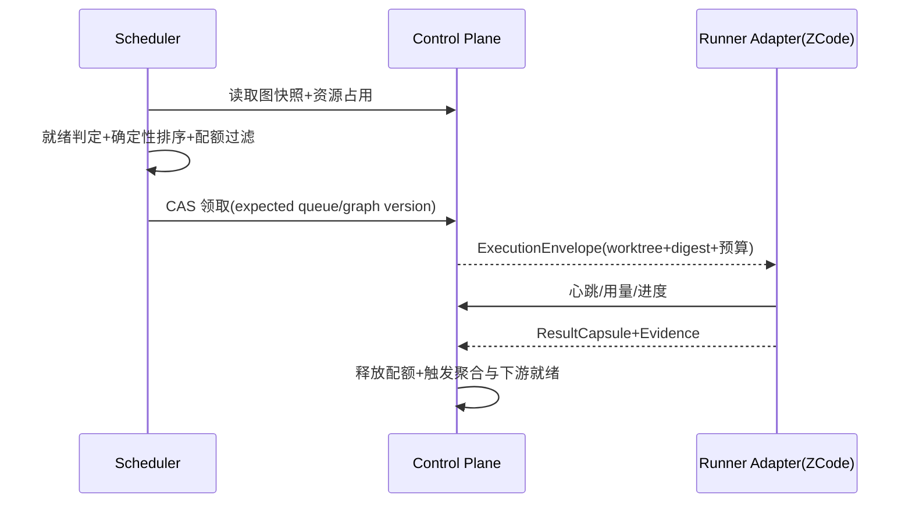

# Work Graph 调度器

> 当前实现说明：队列仅按 role、priority、created_at 选取任务；实际 MCP 领取接口缺少幂等键与队列版本，允许调用方自报 project/role/session；领取结果不含精确 worktree 路径、generation 与 base SHA。本文是 M1 目标设计，未实现。

## 1. 目标与非目标

`WGS-REQ-001`：就绪判定 MUST 是合取：节点所在 PlanRevision 已 sealed、全部 required 依赖 outcome 满足、required artifact 存在且未 stale、能力与权限匹配、预算已预留、资源预留成功。`WGS-REQ-002`：调度 MUST 使用确定性排序，同图快照重放结果一致。`WGS-REQ-003`：领取 MUST 返回统一 ExecutionEnvelope：Task、Lease、精确 worktree 路径、generation、base SHA、context digest 与预算。`WGS-REQ-004`：失败与取消 MUST 按计划策略传播，跨计划边界不传播实时取消。非目标：不定义聚合语义与数据 Schema；当前规模不引入 min-cost max-flow 等全局优化求解器。

## 2. 参与者、角色、权限和信任边界

调度器是服务端独占组件；Worker 不能自选任务或自报身份范围，principal/project/role 由服务端会话绑定决定。ZCode/Codex Runner Adapter 负责以领取到的 worktree 为 CWD 启动、恢复、取消对应 Agent 会话并归一化事件、心跳、用量与结果。评价与执行职责分离：执行 Agent 的产出必须经独立 Gate/Evaluator 判定。

## 3. 触发条件、输入和前置条件

调度触发：PlanRevision seal、Attempt 结束、Lease 过期回收、心跳注册、恢复扫描与策略变更。输入至少包含图快照版本、队列版本与资源占用表；缺失时调度循环跳过本轮并告警，不得用部分数据决策。

## 4. 正常交互及时序图

## 5. 失败、取消、超时、重试、恢复和用户提示

Lease 过期即回收：未产生副作用的回到就绪队列，已产生副作用的转入恢复流程；恢复只续接原 Attempt 绑定（会话、worktree、context digest），无法续接的转 needs_human 并显示原因。队列积压超过水位触发背压：暂停接收新拆分提议或降低 fan-out 上限，并向 Coordinator 反馈稳定压力信号。取消按计划 cancel_policy 传播；超时按预算边界停止并记录用量。

## 6. 状态机、规则和不可变式

任务排序键固定为：priority 降序、deadline 升序、critical_path_length 降序、enqueue_sequence 升序、task_id 升序；Worker 选择键为 resume_affinity 降序、repository_affinity 降序、current_load 升序、worker_id 升序。

- `WGS-RULE-001`：调度决策必须是图快照的纯函数，重放得到相同结果。
- `WGS-RULE-002`：项目、父节点与 Runner 三级并发配额 MUST 强制生效。
- `WGS-RULE-003`：资源 concurrency key（如同仓库写路径）互斥 MUST 强制生效。
- `WGS-RULE-004`：能力路由按 ExecutionRequirement 匹配；Role 不得当 Capability 使用。
- `WGS-RULE-005`：cancelled 节点不得被再次调度；重试走新 Attempt。

## 7. 字段、配置和格式校验

ExecutionEnvelope 字段：task_id、node_revision_id、execution_attempt_id、lease_token 与 epoch、workspace_path、generation、base_sha、context_digest、budget、correlation_id；全部必填且不可为空。心跳间隔、Lease 时长、配额默认值与上限来自版本化项目策略；策略未知时使用最保守默认。排序键类型固定且可比较。

## 8. 并发、幂等和一致性

领取接口必须强制 idempotency_key 与 queue_version（GetNextTaskWithVersion 语义）；重复请求返回既有结论。CAS 贯穿队列版本、图版本与节点版本；调度决策、Audit 与 Outbox 同事务。心跳幂等；用量累计用追加事实而非原地覆盖。

## 9. 安全、Secret、隐私和审计

服务端身份上下文绑定 principal/project/role，禁止自报。Token 不进入 URL、日志与 ResultCapsule；Agent 会话凭证由 Adapter 独立管理并可吊销。每次领取、恢复、取消、背压触发与配额拒绝均审计并携带 correlation_id/causation_id，支持重建完整任务、会话、Lease 与恢复时间线。

## 10. 质量门禁、证据与 fail-closed 规则

`WGS-GATE-001`：调度一致性用例必须证明同快照重放与并发领取唯一成功。`WGS-GATE-002`：恢复演练必须证明中断的 Attempt 可原绑定续接且无重复副作用；任一失败即阻断发布。证据缺失或 stale 时节点不可进入可调度集合。

## 11. 指标、SLO、告警和运维动作

跟踪队列等待时长、fan-out 并发、join 等待、饥饿任务年龄、背压触发率、Lease 回收率与恢复时长。饥饿超阈值、背压持续、恢复失败或重放不一致必须告警；运维动作限定为暂停拆分、缩配额与重放对账，禁止手工改队列顺序。

## 12. 验收测试和需求追踪

- `TC-WGS-001`：两个独立叶子由两个 Worker 并行领取，各自 worktree 隔离。
- `TC-WGS-002`：并发领取仅一方成功；重复幂等键返回既有结论。
- `TC-WGS-003`：强制中断一个 Worker 后原 Attempt 恢复，无重复副作用。
- `TC-WGS-004`：配额与资源 concurrency key 饱和时新任务不被领取并产生背压信号。
- `TC-WGS-005`：同图快照重放调度序列一致；取消传播符合策略且不跨计划边界。

阶段任务与追踪矩阵行待 M1 任务书更新时登记；登记前本文保持 draft。

## 13. 数据迁移、兼容、发布与回滚

实施顺序沿用协作切片：先 ExecutionAttempt/SessionBinding 与 MCP 会话注册/心跳/恢复，再切换 GetNextTaskWithVersion 强制幂等键与队列版本，然后返回 ExecutionEnvelope，随后启用项目内父子层级与能力路由，最后接入 EvaluationRecord 与 ZCode Adapter。旧的 get_next_task 自报身份路径在切换后拒绝，不保留兼容绕过；回滚回到上一已批准 v3 提交并同步回滚规范与追踪状态。
