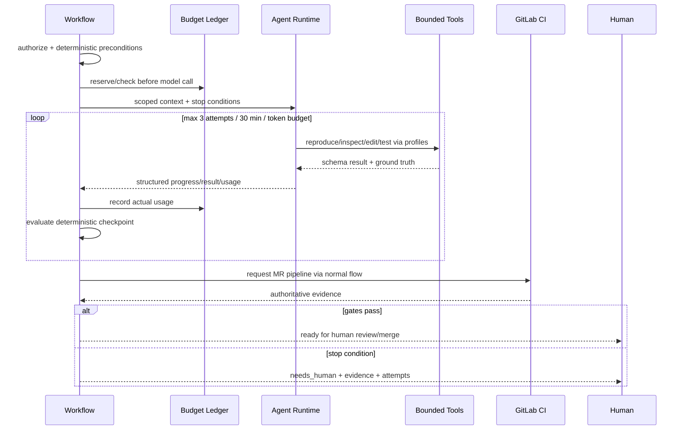
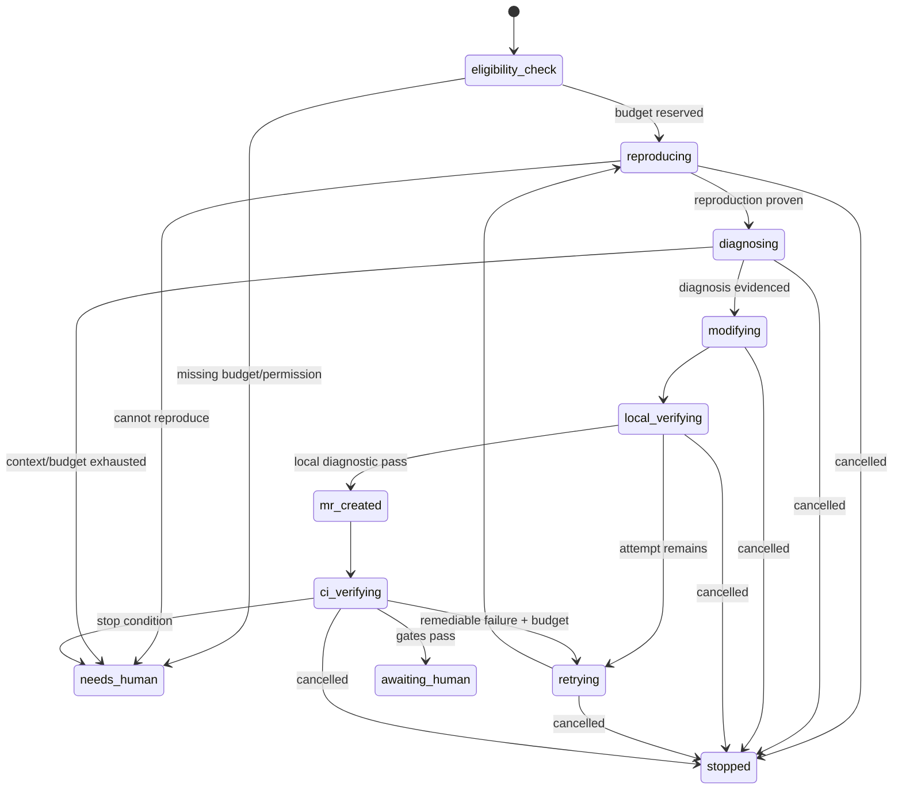

# 确定性 Workflow 与 Agent 执行引擎

> 当前实现说明：现有 TaskService 包含部分固定状态迁移，但没有 durable workflow、预算真记账、模型调用记录、停止条件、human handoff 或安全 Agent loop。本规范未完成实现。

## 1. 目标与非目标

- `WF-REQ-001`：任务状态、授权、门禁、预算、重试、timer、取消和人工检查点 MUST 由确定性 Workflow 代码负责。
- `WF-REQ-002`：Agent 只在步骤不可预估且灵活判断有价值时用于复现、诊断和代码修改；每步必须依据工具返回的 ground truth。
- `WF-REQ-003`：无预算、无法复现、超时/连续失败/低置信度时 MUST 停止并转 `needs_human`，不得猜测“已修复”。
- 非目标：不让 LLM 自行定义工作流、权限、命令、网络、Secret、Gate 或最终合并；不因引入框架而隐藏 Prompt/工具轨迹。

## 2. 参与者、角色、权限和信任边界

Workflow Engine 为服务身份，执行预定义 transition；Agent Runtime 继承委托用户∩项目∩Runner∩Tool 权限；Runner 执行 Command Profile；人类 Coordinator/Verifier 在高风险或停止条件触发时接管。Prompt、仓库、Issue、日志与模型输出均不可信；Tool result 也必须通过 schema 与项目 scope。

## 3. 触发条件、输入和前置条件

自动修复前必须同时满足：Defect `auto_remediable=true`、存在可执行复现步骤/失败 Evidence、非不可豁免安全问题、有效 delegation/Runner、`budget_tokens` 明确且 >0、attempt < policy max、30 分钟 deadline 未到。缺一即不启动 Agent，只创建/更新 human work item。

## 4. 正常交互及时序图

优先采用最简单模式：固定复现→修改→验证使用 prompt chaining；明确缺陷类别用 routing；互不依赖的检查 MAY 并行；只有文件/步骤不可预估时 Agent 才动态选工具。Evaluator 不得由同一 Agent 自证高风险结果。

## 5. 失败、取消、超时、重试、恢复和用户提示

模型调用前预算检查、调用后按 provider 实际 usage 记账；usage 缺失按预留上限扣并转人工核对。默认最多 3 attempts、30 分钟，工具/profile 有更短超时。模型 429/5xx 可在总预算内退避；解析错最多一次修复提示。取消两阶段终止模型 stream、工具进程与 Lease。重启从已持久 checkpoint 恢复，不重复已完成外部副作用。UI 显示步骤、剩余预算/时间、尝试、最近 ground truth 与明确接管原因。

## 6. 状态机、规则和不可变式

- `WF-INV-001`：每次模型调用前先原子 reserve budget，之后记录真实 usage；不得事后才检查。
- `WF-INV-002`：Agent 输出不能直接变更状态，Workflow 必须验证结构化结果和工具 Evidence。
- `WF-INV-003`：同一委托的 Agent 不能 approve/waive/merge；最终 merge 只能人类 GitLab 主体。
- `WF-INV-004`：每个循环有最大尝试/时间/token/工具调用数与明确 success/stop condition。
- `WF-INV-005`：Prompt injection 不能扩大工具 schema、profile、network、Secret 或 project scope。

RemediationRun wire enum 与 `PRD-AGENT-REMEDIATION` 固定一致：`eligibility_check/reproducing/diagnosing/modifying/local_verifying/retrying/mr_created/ci_verifying/awaiting_human/needs_human/stopped`。人工 merge 后由 Defect Workflow 独立验证并推进 Defect `resolved`，不得把 Agent 执行直接标 resolved。

## 7. 字段、配置和格式校验

Workflow Definition 版本化，含 states/actions/guards/timers/retry/compensation；运行实例含 definition version、project/work item/defect/delegation、budget tokens/used/reserved、deadline、attempt、checkpoint、correlation。Agent 结构化输出仅允许 `hypothesis, cited_evidence_ids, next_action, changed_paths, reproduction_status, handoff_reason`；未知字段/引用不存在/路径越界拒绝。工具参数必须匹配 MCP/Command Profile schema。

## 8. 并发、幂等和一致性

每个 Workflow instance 单写者由 DB version/lease 保证；command ID 和 step ID 唯一。timer/outbox 至少一次，step handler 必须幂等。预算 reserve/usage 在同事务，不能透支；并行工具共享总预算并按 reservation 防竞态。外部 MR 创建用幂等关联，重放不重复建 MR。

## 9. 安全、Secret、隐私和审计

Context 只给 just-enough 文件/日志，按相关性选择并有 context budget；不把全部仓库/历史回放。Agent 无 Secret API，网络默认关闭；必要集成由确定性 adapter 代办。Prompt/response/tool trace 脱敏加密保存 30 天；审计模型/provider/version、usage、tool、profile、decision、stop/handoff，不记录 Secret/完整源码。

## 10. 质量门禁、证据与 fail-closed 规则

- `WF-GATE-001`：缺 budget/delegation/reproduction Evidence 或属不可自动修复类型时 Agent 不启动。
- `WF-GATE-002`：每个状态转移必须有确定性 guard 与引用 Evidence；自由文本不能满足 Gate。
- `WF-GATE-003`：Agent MR 必须走与人工 MR 相同 CI/质量/权限 Gate，不得降低门槛。
- `WF-GATE-004`：直接/间接 Prompt injection、工具滥用、预算超支与自审红队必须通过。

## 11. 指标、SLO、告警和运维动作

指标：workflow state age/transition/error、Agent attempts/success/handoff、tokens reserved/used、tool failure、reproduction rate、CI fix rate、cancel latency。任何预算透支、越权工具尝试、Workflow 卡住 > timer+grace、同 Defect 重复 active instance 告警并暂停自动化。

## 12. 验收测试和需求追踪

| 测试 ID | 场景 |
| --- | --- |
| `TC-WF-001` | 无 budget/证据/权限时不调用模型 |
| `TC-WF-002` | 每次模型调用 reserve 与真实 usage 对账且并发不超支 |
| `TC-WF-003` | 三次/30 分钟/不可复现触发 needs_human |
| `TC-WF-004` | crash 重放不重复工具副作用/MR |
| `TC-WF-005` | 恶意 Prompt/仓库文本不能扩大 Tool/Secret/网络/项目权限 |

Agent 能力和安全准入由 golden set、轨迹、人评及红队证据关联，不以单次 demo 作为完成。

## 13. 数据迁移、兼容、发布与回滚

将旧 Task 状态映射到 versioned Workflow instance；无法证明当前 step/owner 的任务进入 `needs_reconcile`。先仅生成建议不改代码，再 shadow Agent、人工确认每步，最后对 allowlist 缺陷启用自动 MR。Workflow definition 一经实例使用不可原地改写，新版本新建定义并提供显式 migration。回滚关闭新实例、排空/取消 Agent，保留 checkpoint；不得将 needs_human 强行标 resolved。
