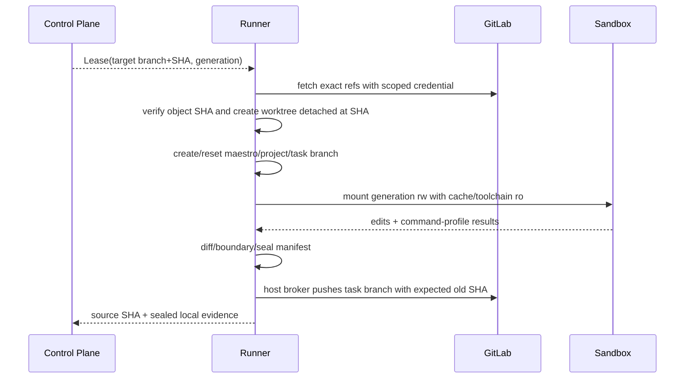
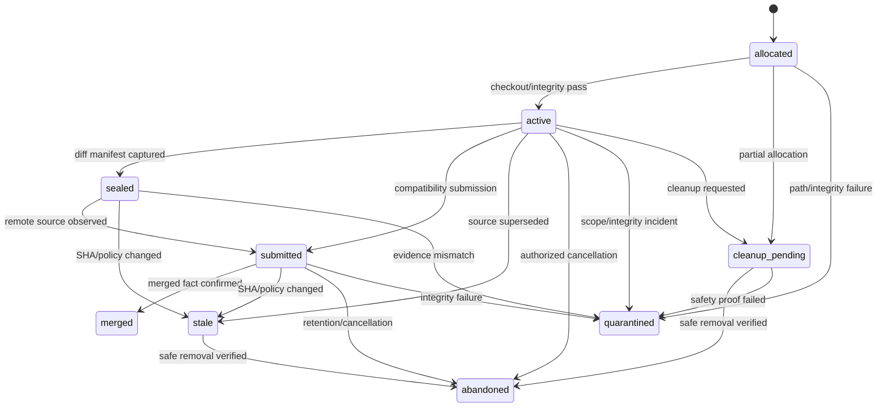

# Runner Workspace 与 Git Worktree 模型

> 当前实现说明：M0 在已 canonicalize 的项目 Git 根目录下创建 `.maestro/worktrees/<task-id>` 与本地 `task/<task-id>` 分支；创建失败会补偿 Lease/Worker/Task，验证缺少 worktree 或 Git 证据时 fail-closed。启动恢复可 quarantine，后台 GC 仅在 DB/Lease/path/branch/Git registration 二次校验通过后执行并支持崩溃重试。远端 baseline、`maestro/<project-key>/<task-id>` 推送、rootless 沙箱和跨 Runner generation fencing 属于 M1/M2，尚未实现。

## 1. 目标与非目标

- `WT-REQ-001`：每次执行 MUST 使用独立、可追踪、受配额的 workspace generation，基线来自 GitLab 远端目标分支精确 SHA。
- `WT-REQ-002`：任务分支 MUST 为 `maestro/<project-key>/<task-id>`，仅该分支可 push；禁止本地合并目标/保护分支。
- `WT-REQ-003`：worktree 创建、校验或清理异常 MUST fail-closed，不得让 Task 进入可提交/完成状态。
- 非目标：不在 Control Plane 管理源码目录；不支持多个任务共享可写 worktree。

## 2. 参与者、角色、权限和信任边界

Control Plane 签发包含 baseline/profile 的 Lease；Runner host 管只读 bare cache、workspace root 与 Git broker；rootless sandbox 只见本 generation；Agent 只能经受控工具访问相对路径。成员既有 GitLab credential 保存在 OS Keychain，仅由 broker 使用且不进入 Agent/沙箱；中央 GitLab Bot 不参与源码 push。GC 是 Runner service identity，不能删除 root 外或非登记目录。

## 3. 触发条件、输入和前置条件

分配输入：project mapping、remote URL、target branch、target SHA、task ID、workspace generation、Command Profile digest、目录边界、资源限制。前置：Runner binding active、磁盘/配额足够、remote Host/证书/commit 验证成功、目标目录为空且 canonical path 位于 workspace root。

## 4. 正常交互及时序图

## 5. 失败、取消、超时、重试、恢复和用户提示

fetch/checkout/worktree/profile/sandbox 任一步失败则记录 `WORKSPACE_*` 错误并不派发 Agent。网络操作可对同一 SHA 幂等退避重试；未知 remote tip 不允许改用本地 HEAD。取消先终止进程树、卸载沙箱、seal 诊断，再标 cleanup_pending。Runner 重启扫描登记表与磁盘 manifest；孤儿目录移入 quarantine，禁止按路径命名直接删除。UI 显示阶段、基线/源 SHA、Runner、配额和清理状态。

## 6. 状态机、规则和不可变式

- `WT-INV-001`：M0 `(project_id, task_id)` 只允许一个活动 Worktree，记录 `generation` 且重建时单调递增；M1/M2 的 `(project_id, task_id, generation)` 全局唯一约束上线前不得并行复用同一路径。
- `WT-INV-002`：manifest 固定记录 target/source SHA、branch、remote host/project、inode/root、profile digest 和文件 digest。
- `WT-INV-003`：workspace 不存在/不一致时提交必须失败；禁止“无 worktree 仍 done”。
- `WT-INV-004`：只 push 任务分支；`done` 与物理 workspace 是否存在无关，来自 GitLab merged 事实。
- `WT-INV-005`：GC 只删除同时满足 DB terminal、manifest ID 匹配、canonical root 匹配、无活动 Lease 的目录。

## 7. 字段、配置和格式校验

branch 使用 `maestro/<project-key>/<task-id>` 并限制字符/长度；remote URL 必须匹配 mapping 的 HTTPS/SSH Host，禁止 file/local protocol 与跨 Host redirect。相对路径 NFC 规范化，拒绝绝对路径、`..`、NUL、设备名、symlink/hardlink 越界与大小写碰撞。workspace root 不得为 `/`、HOME、仓库根的父级或未解析环境变量。

## 8. 并发、幂等和一致性

Runner 对 bare cache fetch 使用仓库锁，对每 generation 使用独立锁；锁顺序 `repo-cache → task-branch → generation`。分配以 Lease+generation 幂等；已有完整 manifest 返回同 workspace，部分目录先 reconcile。Git broker 只接受服务端生成的 mapping/branch/expected old SHA，使用等价于 `--force-with-lease` 的 compare-and-swap；目标变更触发 baseline stale 而非覆盖。Agent 不能指定 remote/refspec/credential。DB 状态与文件系统通过 intent+result 记录和恢复扫描最终一致。

## 9. 安全、Secret、隐私和审计

沙箱 rootless、只读 rootfs、`cap-drop ALL`、`no-new-privileges`、无 Docker Socket/宿主设备/真实 HOME/SSH/cloud credential；网络默认关闭。fetch/push 由沙箱外 broker 访问映射 Host，凭据从 OS Keychain 按句柄读取且绝不下发短期文件、askpass 或环境变量给 Agent。记录 allocation、path violation、broker push、seal、quarantine、GC 审计，但不记录 diff 内容或 token。

## 10. 质量门禁、证据与 fail-closed 规则

- `WT-GATE-001`：远端 SHA、worktree integrity、branch mapping、boundary manifest 任一缺失即拒绝提交。
- `WT-GATE-002`：容器逃逸、symlink/hardlink/path traversal、disk/PID bomb 测试必须通过。
- `WT-GATE-003`：Git broker 拒绝非任务分支/未知 remote/refspec；中央 Bot 无 source push/merge capability；测试项目的 GitLab branch protection 仍作为纵深防御证据。
- 本地 seal 仅诊断，不能替代 GitLab CI Evidence。

## 11. 指标、SLO、告警和运维动作

监控 allocation/fetch/cleanup 时长、active/retained 数、磁盘 inode/bytes、quarantine、orphan、push conflict、integrity failure。磁盘 > 80% 告警并停止新 Lease，>90% 排空；任何 root escape/integrity mismatch 立即吊销 Runner 并保留隔离证据。

## 12. 验收测试和需求追踪

| 测试 ID | 场景 |
| --- | --- |
| `TC-WT-001` | 远端目标 SHA 与 detached checkout/branch 精确一致 |
| `TC-WT-002` | 创建失败、缺失目录、只读挂载均阻断认领/提交 |
| `TC-WT-003` | 两 generation 并行隔离且迟到结果不串用 |
| `TC-WT-004` | 路径/链接/设备/资源逃逸红队 |
| `TC-WT-005` | crash 后 reconcile/GC 不删除活动或 root 外目录 |

## 13. 数据迁移、兼容、发布与回滚

旧 `task/<id>` worktree 不直接复用：记录为 legacy，seal/备份未提交 diff 后重新从远端 SHA 创建新 generation。先以 dry-run inventory 检查磁盘与 branch 冲突，再灰度 Runner。旧本地 merge API 必须在切换前关闭。回滚时停止新 Lease并保留新 workspace；旧版本不得接管 `maestro/*` 分支或新 generation，避免误清理。
