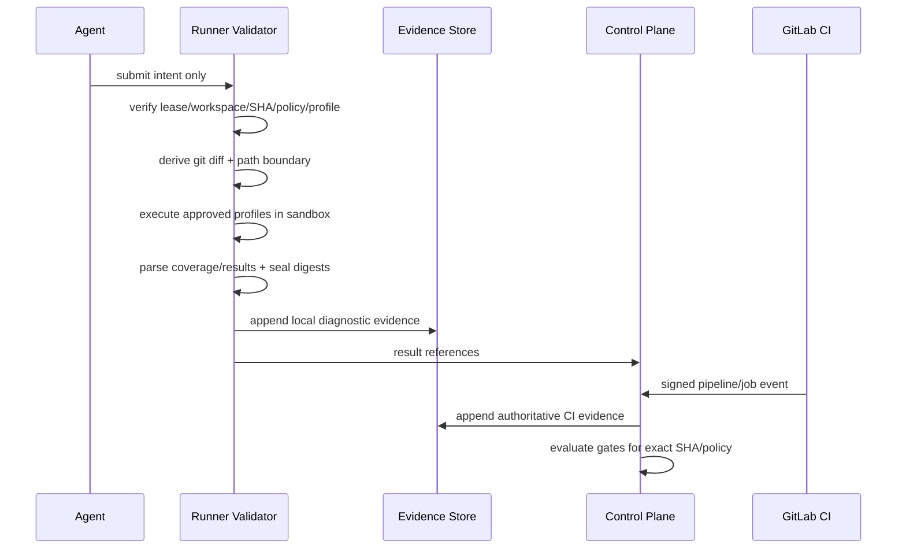
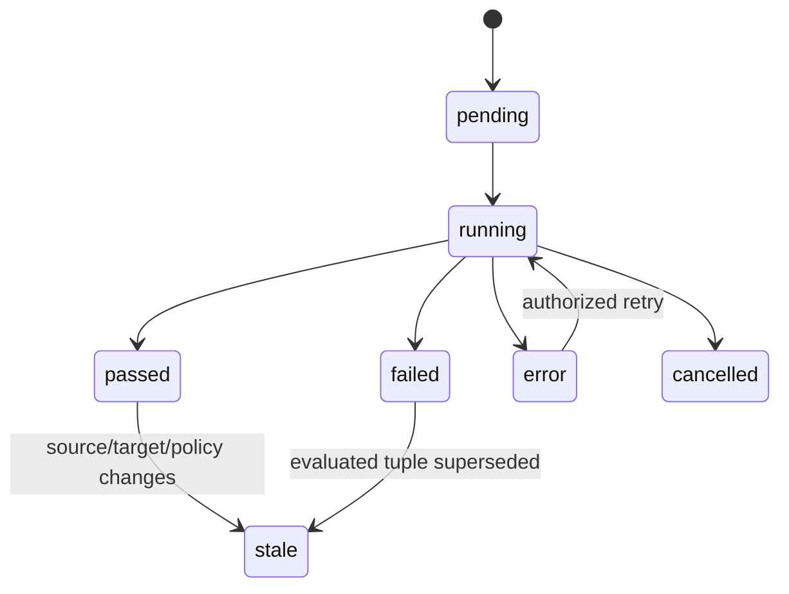

# 零信任验证流水线

> 当前实现说明：M0 已将 Git/worktree/上下文/diff、边界、测试、覆盖率、策略、Profile 和 Evidence 写入改为 fail-closed，并对输出、超时、路径、本地 Evidence 权限和常见 Secret 格式设置硬边界；领取后的上下文失败会原子补偿 Task/Session/Worker/Lease，并根据 Worktree 是否新建、干净或已修改选择清理、重绑定或隔离。公共错误使用稳定 code/message/correlation ID，canary 集成测试验证响应、日志和持久化输出均不泄露敏感细节。当前显式启用的本地 Profile 仍运行于宿主诊断执行器；其 network/resource/image 声明只做完整性校验，尚未由 M1 rootless OCI 沙箱强制执行，因此本地结果固定为 `authority=diagnostic`，不能授权合并。

## 1. 目标与非目标

- `ZTVAL-REQ-001`：Agent 声明、日志文本与客户端上传结果一律视为不可信；所有必需证据由受控 Runner/CI producer 生成并验真。
- `ZTVAL-REQ-002`：边界、Git diff、测试、覆盖率、策略、SHA 任一必需环节缺失、解析错、执行错或超时 MUST 失败。
- `ZTVAL-REQ-003`：Evidence append-only、内容寻址，并与精确 source/target SHA、pipeline/job、policy version 绑定。
- 非目标：本地验证不决定可合并；人工备注不覆盖不可豁免 Gate 或篡改 Evidence。

## 2. 参与者、角色、权限和信任边界

Agent 只能请求提交；Runner 执行版本化 Command Profile并产本地诊断 Evidence；GitLab CI 是合并门禁权威 producer；Verifier 可审核但不能审核自己/自己委托 Agent；Policy Engine 纯确定性；Evidence Store 仅追加。任意仓库文件、测试输出、Prompt 中指令不能改变 profile、网络、Secret、策略或 Gate。

## 3. 触发条件、输入和前置条件

输入必须包含 project/task/execution、有效 Lease generation、远端 target/source SHA、policy ID/version/digest、profile ID/version/digest。workspace integrity、项目范围、策略 schema 与 producer 身份先验证。Required check 列表为空、策略不存在或 baseline 不可获取视为配置错误并阻断。

## 4. 正常交互及时序图

固定步骤：`preflight → baseline freshness → diff → boundary → build/unit/lint/type/integration/contract/security profiles → parse → seal → persist evidence → evaluate gate → transition`。任一步失败仍应追加失败 Evidence；只有 Evidence transaction commit 后才更新 Gate/Task。

## 5. 失败、取消、超时、重试、恢复和用户提示

错误分类：

| Code | 含义 | 重试 |
| --- | --- | --- |
| `VALIDATION_INPUT_INVALID` | schema/profile/policy 无效 | 修正后 |
| `BASELINE_UNAVAILABLE/STALE` | SHA 缺失或漂移 | 获取新基线 |
| `DIFF_FAILED` | Git 命令/对象失败 | 环境恢复后 |
| `BOUNDARY_VIOLATION` | 越界/禁止模式 | 修改代码 |
| `PROFILE_EXEC_ERROR/TIMEOUT` | 沙箱/命令异常 | 受限重试 |
| `TEST_FAILED` | 测试非零 | 修改代码 |
| `COVERAGE_MISSING/INVALID/BELOW` | 证据缺失/解析/阈值 | 修正配置/代码 |
| `EVIDENCE_PERSIST_FAILED` | 证据未落库 | 不推进状态 |

取消必须终止整个进程树并保存 `cancelled` Evidence；输出超过上限时持续流式计数并截断存储，进程不能先无限占内存。Flaky 只自动重跑一次，保留两次结果并需隔离/豁免。

## 6. 状态机、规则和不可变式

- `VAL-INV-001`：`missing/skipped/error/stale/cancelled` 对 Required Gate 均为阻断，不等价 passed。
- `VAL-INV-002`：Evidence payload/digest 不可覆盖；重跑创建新 attempt 与 supersedes 引用。
- `VAL-INV-003`：本地 Evidence `authority=diagnostic`，只有 CI `authority=merge_gate` 可满足合并 Gate。
- `VAL-INV-004`：source 或 target SHA/策略变化立即令旧 Gate stale。

## 7. 字段、配置和格式校验

Evidence 必含 `id, project_id, check_id, attempt, producer, authority, source_sha, target_sha, pipeline_id, job_id, policy_version, profile_digest, status, started/finished_at, exit_code, payload_digest, output_ref, truncated, error_code`。覆盖率范围 0–100，必须声明 parser/version；JUnit/XML/JSON 采用禁用外部实体、大小/深度限制的解析器。Command 只能引用 profile ID+version，参数必须匹配 profile schema，不接受 shell string。

## 8. 并发、幂等和一致性

Evidence 幂等键为 producer external job/attempt + check；唯一 tuple 防重复。Gate 评估读取同一快照中的 active policy 和 Evidence tuple，并以 expected gate version 写入。CI Webhook 乱序由 observed_at 与外部状态机处理；终态不能被旧 running 覆盖。执行不在 DB 事务中，写入 Evidence/Gate/Audit/Outbox 才使用短事务。

## 9. 安全、Secret、隐私和审计

沙箱无默认网络/Secret，profile 明确声明只读 cache 与资源上限；日志按字节流过滤 Secret pattern，完整源码和环境不得持久化。原始 artifact 存加密对象存储并按权限签发短 URL。审计 validation requested/started/failed/passed/stale/waived，记录 producer/profile/policy/digest，不记录敏感输出。

## 10. 质量门禁、证据与 fail-closed 规则

- `VAL-GATE-001`：diff、boundary、policy completeness、build、unit、lint/typecheck、适用 integration/contract、Secret Scan 默认 Required。
- `VAL-GATE-002`：变更行覆盖率 >=80%，总覆盖率下降 <=0.5 个百分点；缺失 baseline/current 均失败。
- `VAL-GATE-003`：Critical/High SAST/依赖/镜像或 license denylist 命中阻断。
- `VAL-GATE-004`：身份隔离、SHA 一致、策略完整、Webhook 真实性不可豁免；其余豁免遵循单 MR/SHA/check、最长 7 天和双人原则。

## 11. 指标、SLO、告警和运维动作

指标包括 validation duration/queue、各 check result/error、output truncated、coverage delta、stale、flaky rerun、Evidence persist latency。Evidence persist 失败、Required check 长期 missing、同一 check error 率 >5%、Secret 命中立即告警；不得自动把 error 改 passed。

## 12. 验收测试和需求追踪

| 测试 ID | 场景 |
| --- | --- |
| `TC-ZTVAL-001` | Git/diff/worktree/policy/coverage 任一故障均失败 |
| `TC-ZTVAL-002` | stdout/stderr 无限输出受流式硬上限且进程树超时终止 |
| `TC-ZTVAL-003` | SHA/policy 漂移即时 stale，旧 Evidence 不可复用 |
| `TC-ZTVAL-004` | profile 参数注入、恶意 XML/路径、Secret 输出被拦截 |
| `TC-ZTVAL-005` | Evidence 写失败时 Task/Gate 不推进 |

不得用“REST equivalent”、mock 提前 return 或宽松多状态码作为真实协议/成功路径证据。

## 13. 数据迁移、兼容、发布与回滚

M0 已关闭任意测试命令和旧 fail-open 分支。升级到 schema v4 时，缺乏可验证 producer/CI 坐标的旧 `validation_runs` 一律保守迁移为 `authority=diagnostic, producer=maestro-local`，不得满足 v3 Gate；禁止把历史 success 推断为 merge authority。新增 profile/policy/Evidence schema 后以 shadow validation 比较，不影响 MR；结果稳定后由 M2 启用 Required Gate。回滚可停止新评估但不得恢复“无证据通过”；新 Evidence 保持只读可审计，旧服务不得覆盖。
