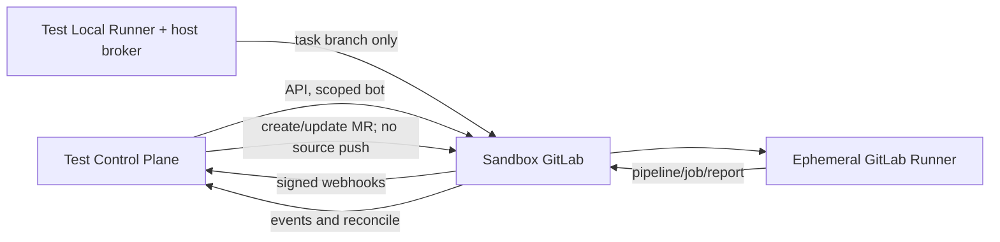

# GitLab Sandbox 验证计划

> 本计划使用隔离的自建 GitLab 测试 Group/Project，不表示仓库当前已有 GitLab Connector、Webhook 或 `.gitlab-ci.yml`。

## 1. 目标与非目标

`GL-TEST-REQ-001`：在真实 GitLab API、Webhook、Protected Branch、MR Pipeline 和 Runner 上证明完整协作闭环。`GL-TEST-REQ-002`：覆盖当前生产 GitLab 版本和前一受支持 minor 的能力差异。Sandbox 不连接生产项目、Runner、Secret 或用户目录，也不允许 Maestro 自动执行最终 merge。

## 2. 参与者、角色、权限和信任边界

Platform Admin 创建测试 Instance 配置；Project Admin 绑定 Sandbox；Bot 仅有读取项目、创建/更新 MR和状态同步所需最小权限，不含源码 push/merge capability；Runner 宿主 Git broker 用隔离测试用户凭据只写任务分支；GitLab Human Maintainer 负责最终 merge；专用非 privileged Runner 执行 CI；Webhook Receiver 仅接受 Sandbox Host。

## 3. 触发条件、输入和前置条件

Connector、Webhook schema、Token scope、GitLab/Runner 版本、Pipeline/Gate 或分支策略变化时全量运行。准备私有 Group、至少两个 Project、目标/依赖仓库、两个用户、Project Access Token、Webhook Secret、专用 Runner 和 TLS 信任链；记录 GitLab version/edition/capabilities。

## 4. 正常交互及时序图

基准场景：解析 numeric project ID/default branch/target SHA→创建 `maestro/<project>/<task>`→push→创建 MR→触发 MR Pipeline→摄取 Job/Artifact→Gate ready→人类审批/merge→merged 事件确认 done。

## 5. 失败、取消、超时、重试、恢复和用户提示

注入 GitLab 429/5xx/timeout、Webhook 禁用/延迟/丢失、重复/乱序事件、Token 过期、Runner offline、Pipeline cancel/fail/skip、Artifact 丢失和 MR conflict。Connector 按 Retry-After 退避，创建操作先查询远端 identity 再重试；事件失败进 DLQ，并由 Reconcile 收敛。界面显示 last sync、GitLab 链接、错误分类和 Runbook。

## 6. 状态机、规则和不可变式

Sandbox Run：`provisioning → ready → executing → verifying → passed/failed → cleaning`。

- `GL-TEST-RULE-001`：baseline 必须等于 GitLab 远端目标分支 SHA，不接受本地 HEAD。
- `GL-TEST-RULE-002`：Bot 无源码 push/merge capability；broker 只接受 `maestro/*` 与 expected old SHA；保护分支 direct/force push 作为纵深绕过测试必须失败。
- `GL-TEST-RULE-003`：source/target SHA 变化使旧 Evidence 和 status stale。
- `GL-TEST-RULE-004`：Webhook 重试只产生一次业务效果，丢失事件由对账恢复。
- `GL-TEST-RULE-005`：done 仅在远端 merged 事实后出现。

## 7. 字段、配置和格式校验

项目映射使用 Instance ID + numeric project ID，覆盖同名 project、rename/transfer、默认分支变更和 URL 编码 namespace。Webhook 测试覆盖 event ID、timestamp、HMAC/兼容 Token、project ID 和 body 上限。MR 覆盖 source/target SHA、fork 禁止策略、draft、conflict、approval、pipeline retry 和 stale status。

## 8. 并发、幂等和一致性

并发创建同一任务分支/MR、重复提交同一 status、Pipeline 重试、快速 push 多个 SHA、Webhook 乱序和对账并发都必须执行。断言唯一 MR identity、status 绑定正确 SHA、旧 Pipeline 不覆盖新结果、API 409/429 被安全处理且无重复任务。

## 9. 安全、Secret、隐私和审计

每次 Run 创建独立短期 Token/Secret，结束即吊销；禁止复用个人 PAT。CI 使用专用变量和 canary Secret，验证恶意 Job 无法获取其他 Project Secret。审计项目绑定、Token reference、Webhook verify/replay、API 操作、MR/status/Pipeline 同步、人工 merge 和 cleanup。

## 10. 质量门禁、证据与 fail-closed 规则

Sandbox Gate 要求 Protected Branch/approval 配置、MR Pipeline rules、GitLab Runner 隔离、Webhook 真实性、Pipeline/Artifact Evidence 和 Reconcile 全部通过。套餐不支持 External Status Check 时必须验证 CI quality-gate/commit status 回退；不允许关闭“Pipeline 必须成功”。能力未知或安全设置无法读取时项目保持 unverified。

## 11. 指标、SLO、告警和运维动作

采集 API latency/rate limit、Webhook ingest/lag/retry/DLQ、Pipeline duration、Reconcile diff、status conflict 和 cleanup leak。Webhook 正常事件 60 秒内反映；Sandbox cleanup 30 分钟内完成。任何未吊销 Token、残留 Runner、可直推保护分支或 DLQ 非零阻断结果。

## 12. 验收测试和需求追踪

- `TC-GLSBX-001`：真实 API/Webhook/MR Pipeline/人工 merge 全链路。
- `TC-GLSBX-002`：HMAC/Token、timestamp、重复、乱序、重放和 auto-disabled webhook。
- `TC-GLSBX-003`：Protected Branch、approval、source/target SHA stale 和冲突路径。
- `TC-GLSBX-004`：429/5xx、Runner offline、Pipeline/Artifact 失败与 Reconcile 恢复。
- `TC-GLSBX-005`：版本/edition capability 检测及受支持 fallback。

参考官方接口：[Webhooks](https://docs.gitlab.com/user/project/integrations/webhooks/)、[Merge Requests API](https://docs.gitlab.com/api/merge_requests/)、[Pipelines API](https://docs.gitlab.com/api/pipelines/)、[Protected Branches API](https://docs.gitlab.com/api/protected_branches/)、[Runner Security](https://docs.gitlab.com/runner/security/)。

## 13. 数据迁移、兼容、发布与回滚

Sandbox project 使用 IaC/脚本按 run ID 创建，销毁前导出脱敏证据并吊销所有凭据。版本升级前后运行同一 suite 并保存 capability diff。Connector 发布先 shadow Webhook/Reconcile，再 enforce；失败回滚保留 Inbox 水位、远端分支/MR identity 和 stale 状态，不删除尚需人工处理的 MR。
