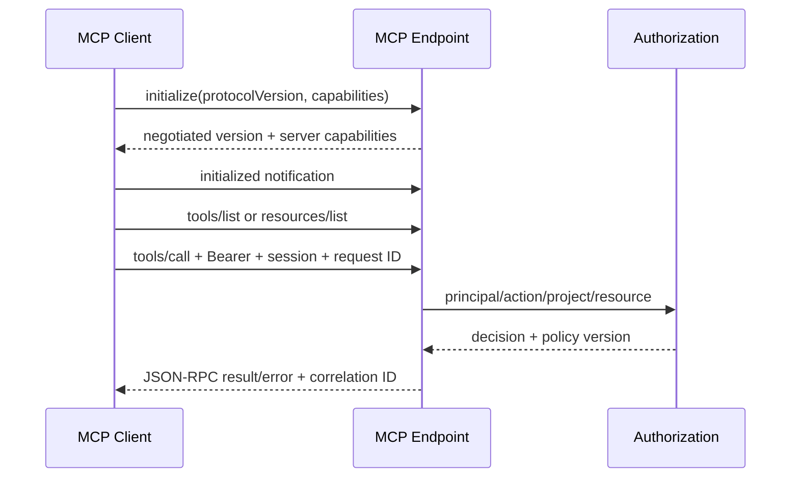

# MCP 协议与工具测试指南

> v3 远程 MCP 目标为当前稳定规范的 Streamable HTTP；旧独立 HTTP+SSE transport 不作为新实现目标。M0 已用真实 stdio 与 Streamable HTTP 客户端覆盖 initialize/tools/list/ping，并以 stdio 完成 claim/heartbeat/幂等重放/stale CAS/上下文失败补偿/submit 的成功和失败链；stdio 的 stdout 只允许 JSON-RPC、EOF 后正常退出，公共错误仅暴露稳定 code/message/correlation ID。远程 OIDC、服务端连接上下文项目绑定及权威 v3 Tool 目录仍属于 M1，因此不得把 M0 兼容 Tool 的自报 scope 当作远程授权。

## 1. 目标与非目标

`MCP-TEST-REQ-001`：验证 stdio 与远程 Streamable HTTP 的协议协商、认证、会话、Tool/Resource、错误和恢复行为。`MCP-TEST-REQ-002`：证明 MCP 与 REST 复用同一业务授权、幂等和审计语义。测试不以直接调用 Go handler 替代真实 JSON-RPC 字节流。

## 2. 参与者、角色、权限和信任边界

Conformance Client 生成合法/恶意 JSON-RPC；Authorization Server 签发 Maestro audience Token；MCP Endpoint 处理 initialize/session/tool/resource；Policy Engine 决策；Runner/GitLab 为受控后端 fixture。客户端能力声明、Tool 参数、Resource URI、Origin 和 Token 全部不可信。

## 3. 触发条件、输入和前置条件

MCP SDK/规范版本、Tool Schema、权限、transport、session 或错误码变化必须运行全量。环境需启用 TLS 测试入口、固定 MCP protocol 版本、独立测试 issuer、至少两个项目和角色矩阵；远程测试不得使用 auth-disabled 配置。

## 4. 正常交互及时序图

分别测试 stdio framing/EOF 和 Streamable HTTP POST/GET、可恢复事件流、session header、协议版本 header、无 SSE 客户端降级。每个 Tool 进行 list schema、最小合法、完整合法、未知/缺失/超长字段和业务失败测试。

## 5. 失败、取消、超时、重试、恢复和用户提示

Malformed JSON/JSON-RPC、未知 method、版本不支持、session 失效、Token 过期、Origin 不符、body 超限和后端超时必须返回规范错误且无业务副作用。客户端断线后以同一幂等键/operation ID 查询，不新建写操作；session 过期可重新 initialize，但不能恢复旧授权或 Lease。取消只取消可取消 operation，不回滚已提交事务事实。

## 6. 状态机、规则和不可变式

Session：`uninitialized → initialized → active → expired/closed`；Request：`received → authenticated → authorized → executed → responded`。

- `MCP-TEST-RULE-001`：initialize 前的业务 method 必须拒绝。
- `MCP-TEST-RULE-002`：每个 HTTP 请求独立携带有效 Bearer；session ID 不是身份凭据。
- `MCP-TEST-RULE-003`：Tool 参数中的 role/project/session 不得扩权。
- `MCP-TEST-RULE-004`：同一 Tool 与 REST 动作具有相同结果、版本冲突、幂等和审计。
- `MCP-TEST-RULE-005`：未授权 Resource 不出现在 list/read 中，跨项目 URI 返回资源隐藏语义。

## 7. 字段、配置和格式校验

使用 `tools.schema.json` 生成正反样例，拒绝 additional properties、未知 enum、浮点替代整数、NUL、过长文本、路径穿越和任意命令字符串。Origin 必须精确匹配 HTTPS allowlist；session ID 至少 128 bit CSPRNG、不可猜测且绑定连接上下文。Token 测试覆盖 issuer、audience、签名算法、exp/nbf、scope 和撤销。

## 8. 并发、幂等和一致性

同一 session 内并发 request ID 独立关联；重复 JSON-RPC ID 不作为业务幂等键。写 Tool 必须显式 idempotency key 和 expected version；相同键相同 payload 返回原响应，不同 payload 冲突。测试断线、重复 POST、乱序事件、session 重建和两个客户端竞争 claim。

## 9. 安全、Secret、隐私和审计

抓包、日志、错误和 Tool result 不得包含 Token、Cookie、Secret 或未授权 Resource。审计覆盖 initialize、认证/授权、Tool/Resource、取消、限流和协议错误，记录 MCP request ID 与业务 correlation ID。测试证书和 Token 仅在隔离环境生成并在结束时吊销。

## 10. 质量门禁、证据与 fail-closed 规则

发布 Gate 要求官方协议 conformance、全部 Tool Schema、RBAC 正反矩阵、跨项目隔离、Origin/Token/session 安全、断线幂等和压力测试通过。未知协议版本、授权服务异常、Tool Schema 加载失败或审计无法提交时写 Tool 必须失败。不得以“客户端不会发送”作为缺少服务端校验的理由。

## 11. 指标、SLO、告警和运维动作

测试输出 protocol/transport/version 组合通过率、Tool 覆盖率、JSON-RPC 错误分布、首响应/流延迟和断线恢复时间。普通只读 Tool P95 < 500ms（不含外部 CI），授权 P95 < 50ms。协议错误或 401/403 激增须可在生产指标中按客户端版本定位。

## 12. 验收测试和需求追踪

- `TC-MCPTEST-001`：initialize、capability negotiation、list/call/read 与关闭全流程。
- `TC-MCPTEST-002`：stdio 和 Streamable HTTP 业务语义一致。
- `TC-MCPTEST-003`：OAuth audience、Origin、session、资源隐藏和 Token passthrough 防护。
- `TC-MCPTEST-004`：每个 Tool Schema 正反用例及 REST parity。
- `TC-MCPTEST-005`：断线、重复、并发、取消和 session 过期无重复副作用。

## 13. 数据迁移、兼容、发布与回滚

旧 SSE 客户端进入有期限的只读兼容清单，不允许写或安全降级；新客户端必须 Streamable HTTP。协议至少兼容当前和前一支持版本，能力不支持时明确协商失败。Tool 破坏性变更新增版本而非静默改义；回滚不得恢复匿名远程 MCP、共享 Token 或跨项目资源。
