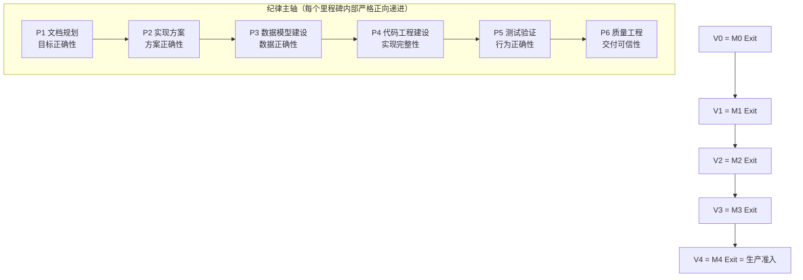

# Maestro-MCP 长程执行管线（工作层总纲）

> **定位**：本文是执行编排的工作层文档，不是权威真源。任何规则冲突以 `docs/README.md` 的权威顺序为准（decisions > prd > security/quality > technical > specs > testing > delivery）。31 个 Stage Task ID、Requirement/Test ID、Exit Gate 条目以 `docs/delivery/` 各任务书与 `docs/governance/traceability-matrix.csv` 为唯一权威；本文件只回答"何时、谁、以什么顺序、怎么防跑偏"。

## 1. 双轴管线模型

- **纪律主轴 P1–P6**：每个里程碑（M0 收尾、M1–M4）内部必须走完 P1→P6，环节间设出口 Gate，不满足不得进入下一环节（fail-closed 递进）。产物逐环节传递：P1 需求锚定卡 → P2 冻结契约 → P3 schema/迁移 → P4 代码+单元测试 → P5 测试 Evidence → P6 审计闭环与状态翻转。环节定义见 [DISCIPLINE-PHASES.md](DISCIPLINE-PHASES.md)。
- **里程碑轴 V0–V4**：V0 = M0 Exit（目标提交 + 远程 CI Evidence + 角色签署），V1–V4 = M1–M4 Exit Gate。验证与状态翻转严格按序，任何并行不得越过。
- **并发轴 S1–S6 + 集成会话**：6 条工作流跨阶段并发。**下游阶段的提前量只允许到 P1–P3**（文档/设计/数据模型不受上游运行时依赖阻塞）与预备分支上的 P4；P4 正式合入、P5/P6 验证仍按 V 点收敛排序。"并行"永远不等于"跳环节"。

## 2. 防偏离体系（七道防线）

针对"目标错误、执行偏离"逐环节设防：

1. **目标锚定**：P1 产出的需求锚定卡（Requirement/Rule/Gate/Test ID + 验收标准 + 非目标）是唯一目标接口。会话任务书只能引用锚定卡，不得自行改写目标或验收标准；目标变更必须走权威文档 MR + owner 评审。
2. **契约冻结**：P2 产出的接口/schema/事件目录在波次内冻结；变更只能由集成会话唯一入口发起。咽喉点文件（`internal/handler/router.go`、`internal/model/model.go`、`internal/config/config.go`、`internal/store/interfaces.go`、`docs/specs/**`、`docs/governance/traceability-matrix.csv`）的变更只随契约 PR 落地。
3. **环节出口 Gate**：P1–P6 逐环节 fail-closed 递进，无跳环；无数据模型变更的阶段也必须显式记录"本阶段无数据模型影响"，不允许静默跳过 P3。
4. **机器一致性检查**：docs-check / spec-consistency / schema-check / asyncapi / mermaid / test-hygiene 在对应环节出口强制执行（命令见环节定义卡）。
5. **traceability 单写者闭环**：矩阵只由集成会话更新；每行实现/验证状态必须与实际代码和 Evidence 对齐，禁止推测填写。
6. **偏离检测与回正**：收敛点审计输出偏离项分级（目标偏离 / 契约偏离 / 实现偏离 × Critical/High/Medium/Low），补丁冲刺修复并回归，复盘记录根因与预防项。
7. **红线清单**：CLAUDE.md 工程不变量逐条化为 P6 审计核对表（见 [QUALITY-AUDIT.md](QUALITY-AUDIT.md)），包括默认拒绝、无隐藏旁路、Evidence 绑定提交、本地 Evidence 仅 diagnostic、不推保护分支、预算先检后调、人审合并等。

## 3. 全量任务映射（31 任务 + M0 收尾 + M0.5 项）

| 收敛点 | 波次 | 任务 | 责任流/会话 |
|---|---|---|---|
| V0 | W0 | M0-DOC-001、M0-BLD-001、M0-RUN-001、M0-STATE-001、M0-VAL-001、M0-SEC-001、M0-TST-001 收尾（7 项） | F0 修复会话 + I0 收口会话 |
| V1 | W1 | M1-ARCH-001 | I1 契约冻结 sprint |
| V1 | W1 | M1-AUTH-001、M1-MCP-001（含 M0.5：会话-任务绑定、Session/Worker 注册协议对齐 runner.yaml、领取幂等键/队列版本对齐 tools.schema.json、返回 worktree 路径、替换参数自报身份） | S2 |
| V1 | W1 | M1-DATA-001、M1-DEP-001 | S1 |
| V1 | W1 | M1-RUN-001（含 M0.5：Command Profile 配置化下发） | S3 |
| V2 | W2 | M2-GL-001、M2-WHK-001、M2-MR-001、M2-QG-001、M2-SEC-001 | S4（可拆 S4a：GL+MR，S4b：WHK+QG） |
| V2 | W2 | M2-GIT-001 | S3 |
| V3 | W3 | M3-CTR-001、M3-INT-001、M3-DEF-001、M3-DSP-001、M3-BUD-001、M3-AGT-001 | S5（可拆 S5a：CTR+INT+DEF/DSP，S5b：BUD+AGT） |
| V4 | W4 | M4-UI-001、M4-EVAL-001、M4-PILOT-001 | S6 |
| V4 | W4 | M4-OBS-001、M4-REL-001 | S1 |
| V4 | W4 | M4-RBK-001 | S3 |

核对：7(M0)+6(M1)+6(M2)+6(M3)+6(M4)=31，全覆盖、无新增 ID、矩阵保持 31 行。

**M0.5 处置口径**（已与 product_owner 确认）：复盘同步文档中的 10 项 Codex→ZCode 阻断，凡属"代码与既有权威 spec 漂移"的（幂等键/队列版本、会话注册、worktree 路径、Command Profile、自报身份）并入 M1 对应任务；凡属后续阶段能力的（真实 GitLab CI Evidence→M2、Agent 适配器→M3）留在原阶段；父子任务/capability routing/typed Artifact 等新实体**暂缓**，等 ADR-009 Work Graph 走到 approved 后在收敛点由 S2/S5 契约修订吸收。

## 4. 波次节奏

| 波次 | 区间 | 活跃会话 | 主轴递进 | 开局动作 | 收敛动作 |
|---|---|---|---|---|---|
| W0 | →V0 | F0、I0（2–3 个） | M0 的 P4–P6 | 核对 m0 书第 6 节"仍未关闭"清单 | V0 收敛仪式（提交编舞→CI→签署） |
| W1 | V0→V1 | I1 + S1/S2/S3 主攻；S4/S5/S6 做下阶段 P1–P3 预备（峰值 7 个会话，可按需裁剪） | M1 全主轴 + M2/M3/M4 的 P1–P3 提前量 | I1 契约冻结 sprint（ARCH 骨架 + 契约 PR + CI 扩展设计） | V1 收敛仪式 |
| W2 | V1→V2 | S4 主攻（可拆 2）+ S3 收尾 GIT + S5 进入 P4（对 mock MR）+ S6 演进 + S1 OBS/REL 预备 | M2 全主轴 + M3 的 P4 提前量 | I2 契约冻结（Webhook/MR/Evidence 契约） | V2 收敛仪式 |
| W3 | V2→V3 | S5 主攻（可拆 2）+ S4 豁免加固 + S6 评测数据集 + S1 OBS 实装 | M3 全主轴 + M4 的 P4 提前量 | I3 契约冻结（Finding/Defect/预算契约） | V3 收敛仪式 |
| W4 | V3→V4 | S6 主攻试点 + S1 REL 定稿 + 全线打磨 + I4 准入彩排 | M4 全主轴 | I4 契约冻结（控制台/评测契约） | V4 生产准入 Gate 全要素彩排 |

粗估日历（仅排期参考，不构成承诺）：W0 约 2–4 天；W1 约 2–3 周；W2 约 2–3 周；W3 约 2 周；W4 约 2–3 周。

## 5. 会话操作规程

**开会话**：用户手动开启新 ZCode 会话，输入对应 brief 文件路径即可，例如"读 `plans/streams/s2-identity-protocol.md`，从当前任务开始执行"。每份 brief 自包含（必读清单、文件边界、DoD、验收命令、交接物）。

**会话内固定开场顺序**（写入每份 brief）：
1. `CLAUDE.md`（工程不变量红线）
2. `docs/README.md`（权威顺序与状态纪律）
3. 本流 brief + 当前里程碑的 `plans/stages/m*.md`（主轴位置）
4. 对应 `docs/delivery/m*.md` 任务书 + 涉及的 ADR/领域文档/机器规范

**分支协议**：V0 之后 main 受保护。流内工作在短生命周期分支（`s1/data-pg-store` 风格）→ 流内门禁（`make build test vet lint`）→ PR 合入。咽喉点文件变更不进流内 PR，积攒到契约 PR 由集成会话合入。

**契约变更流程**：流发现契约需要变更 → 在 brief 交接物中登记变更请求（原因/影响/方案）→ 集成会话评审 → 契约 PR（含 `docs/specs/**` 与咽喉点代码）→ 各流 rebase。禁止流内直接改契约。

**矩阵单写者**：`docs/governance/traceability-matrix.csv` 只由集成会话在收敛仪式中更新；流会话在交接物中报告"哪些 Task ID 达到 implemented 候选、Evidence 在哪"，不直接改矩阵。

**状态纪律**：三状态分离（spec/implementation/verification）贯穿始终；`partial/unverified` 是常态诚实状态，只有 P6 完成全套动作（远程 CI Evidence + 签署 + commit 绑定）才翻转。

## 6. 质量环

三层：任务级 DoD（统一口径 = `docs/delivery/README.md` 第 10 章）→ 流内门禁（P4 出口）→ 收敛点审计（P6，查缺补漏 + 补丁冲刺 + 复盘）。程序、清单、偏离分级、复盘模板见 [QUALITY-AUDIT.md](QUALITY-AUDIT.md)。

## 7. 文件索引

| 文件 | 用途 |
|---|---|
| [DISCIPLINE-PHASES.md](DISCIPLINE-PHASES.md) | P1–P6 环节定义卡（入口/产出/出口 Gate/命令） |
| [stages/m0-closure.md](stages/m0-closure.md) | M0 收尾执行计划（W0） |
| [stages/m1-control-plane.md](stages/m1-control-plane.md) | M1 执行计划（W1） |
| [stages/m2-gitlab-quality.md](stages/m2-gitlab-quality.md) | M2 执行计划（W2） |
| [stages/m3-defect-agent.md](stages/m3-defect-agent.md) | M3 执行计划（W3） |
| [stages/m4-governance-pilot.md](stages/m4-governance-pilot.md) | M4 执行计划（W4） |
| [streams/s1-data-platform.md](streams/s1-data-platform.md) ~ [streams/s6-console-eval.md](streams/s6-console-eval.md) | 6 份会话任务书 |
| [convergence/v0-m0-closure.md](convergence/v0-m0-closure.md) ~ [convergence/v4-production-admission.md](convergence/v4-production-admission.md) | 5 份收敛手册（联调剧本 + 状态翻转） |
| [QUALITY-AUDIT.md](QUALITY-AUDIT.md) | 质量工程程序与审计清单 |

## 8. 暂缓项与风险

- **Work Graph（ADR-009，draft）**：暂缓。获批后在最近的收敛点由集成会话组织 S2/S5 做契约修订；在此之前任何流不得实现其概念。
- **真实基础设施**（公司 VM / 自建 GitLab / 公司 OIDC）：本地 Docker Compose 优先（PostgreSQL、Keycloak 或 Dex、GitLab CE 容器化）；真实环境接入作为各收敛手册的可选升级步骤，不阻塞开发。
- **m2–m4 任务书的治理修订**：在各自波次开局 just-in-time 进行（I2/I3/I4 的 P1 动作），本轮不动。
- **并行冲突风险**：咽喉点之外的"需协调"文件（见各流 brief 第 4 节）修改前在流间登记；集成会话拥有仲裁权。
- **AI 会话跑偏风险**：任何会话发现自己在做 brief 之外的事，先停下登记偏离项，等集成会话裁决，不自行扩权。
